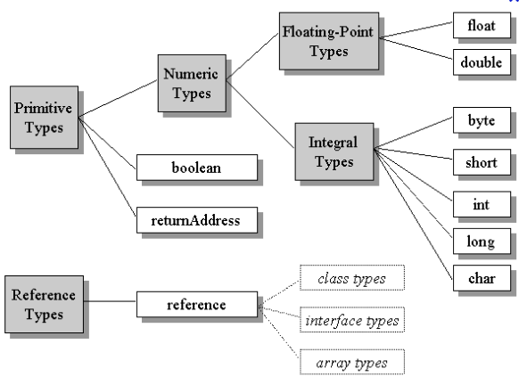
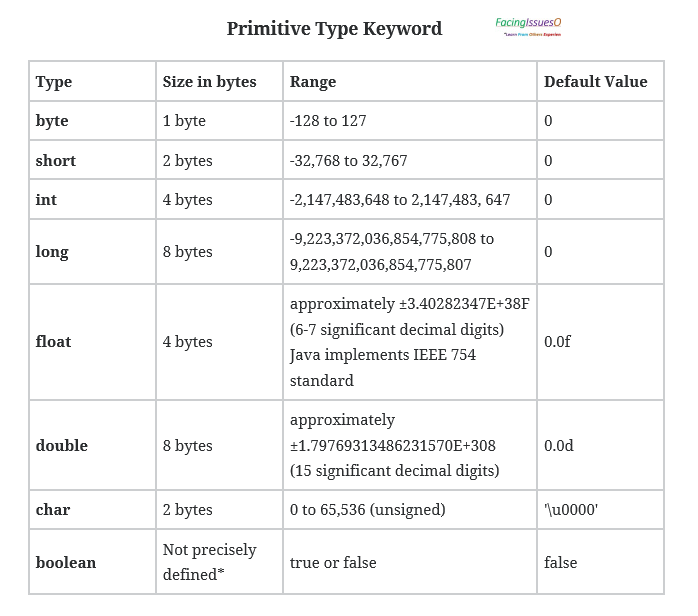

# Java : Primitive Type

>Primitive types are the most basic data types available in Java language which are having predefined fixed size, range, default values and no methods. These types serve as building blocks of data manipulation in java language.

>Primitive Type: boolean, byte, char, short, int, long, float and double.

Primitive types further classified into three categorize:

- **Numeric Primitive**: short, int, long, float and double. These primitive data types can hold only numeric data. We can perform arithmetic and comparison operations with this data.
- **Textual Primitive**: byte and char. These primitive data type can hold characters. We can perform the operation as compare character, add characters to make words, etc. byte and char also used for arithmetic operations
- **Boolean** and **null** primitives: boolean and null.

**Classification of Data Types in Java Programming Language**


Type |	Contains| 	Default| 	Size|
|---|---|---|---|
|boolean |	true or false |	false 	|1 bit
|char 	|Unicode Character |	u0000 |	16 bits
|byte 	|Signed Integer |	0 	|8 bits
|short 	|Signed Integer |	0 |16 bits
|int 	|Signed Integer |	0 	|32 bits
|long 	|Signed Integer 	|0 	|64 bits
|float 	|Floating Number |	0.0 |	32 bit
|double 	|Floating Number |	0.0 |	64 bit


**Data Type and Other Details**



Points to remember about Primitive Type :

*     These primitive types are pre-defined java keyword. These types can not use as identifiers.
*     These keywords can also be used to declare a method return type.
*     Character literals should be surrounded with a single quote (‘ ‘) i.e ‘a’ or ‘A’.
*     Floating values should have end character as f or F. i.e 1.35f.
*     Decimal values should have end character as d or D i.e  3.245d.
*     A floating-point number can also be a scientific number with an “e” to indicate the power of 10.

## Numbers

Numeric primitive type divided into two groups :

1.     Integer Types: Stores whole numbers, positive and negative values (-25 or 430, etc.),  without decimal points. Valid types are byte, short, int and long.
2.     Floating Types: Stores numbers with fractional parts, contains one or more decimals. Valid types are float and double.

>Note: The precision of a floating-point value indicates how many digits the value can have after the decimal point. The precision floatis only six or seven decimal digits, while variablesdouble have a precision of about 15 digits. Therefore it is safer to use fordouble most calculations.

## Representation of Primitive Type

Below are an example of all primitive types:

```	
int myAge = 15;               // Integer (whole number)
float salary = 50000.99f;    // Floating point number
char sex = 'M';              // Character
boolean employed = true;     // Boolean
```

## Scientific Numbers
A floating-point number can also be a scientific number with an “e” to indicate the power of 10.

```	
float f1 = 35e3f;
double d1 = 12E4d;
System.out.println(f1);
System.out.println(d1);
```
