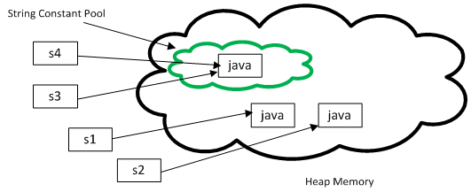

# Difference between String literal and New String object in Java
----

String is a special class in Java API and has so many special behaviours which is not obvious to many programmers. In order to master Java, first step is to master String class, and one way to explore is checking what kind of String related questions are asked on Java interviews. Apart from usual questions like why **String is**, or  **equals vs == operator**, one of the most frequently asked question is what is difference between String literal and String object in Java. For example, what is the difference between String object created in following two expression :

```java
String strObject = new String("Java");
```
and

```java
String strLiteral = "Java";
```

>Both expression gives you String object, but there is subtle difference between them. When you create String object using ```new()``` operator, it always create a new object in **heap memory**. On the other hand, if you create object using String literal syntax e.g. "Java", it may return an existing object from String pool (a cache of String object in Perm gen space, which is now moved to heap space in recent Java release), if it's already exists. Otherwise it will create a new string object and put in string pool for future re-use. In rest of this article, why it is one of the most important thing you should remember about String in Java.

## What is String literal and String Pool
Since ```String``` is one of the most used type in any application, Java designer took a step further to optimize uses of this class. They know that Strings will not going to be cheap, and that's why they come up with an idea to cache all String instances created inside double quotes e.g. "Java". These double quoted literal is known as String literal and the cache which stored these ```String``` instances are known as as String pool. In earlier version of Java, I think up-to Java 1.6 String pool is located in permgen area of heap, but in Java 1.7 updates its moved to main heap area. Earlier since it was in PermGen space, it was always a risk to create too many String object, because its a very limited space, default size 64 MB and used to store class metadata e.g. .class files. Creating too many String literals can cause ```java.lang.OutOfMemory```: permgen space. Now because String pool is moved to a much larger memory space, it's much more safe. By the way, don't misuse memory here, always try to minimize temporary String object e.g. "a", "b" and then "ab". Always use ```StringBuilder``` to deal with temporary String object.

## Difference between String literal and String object


At high level both are String object, but main difference comes from the point that new() operator always creates a new String object. Also when you create String using literal they are interned. This will be much more clear when you compare two String objects created using String literal and new operator, as shown in below example :

```java
String a = "Java";
String b = "Java";
System.out.println(a == b);  // True
```

Here two different objects are created and they have different references:

```java
String c = new String("Java");
String d = new String("Java");
System.out.println(c == d);  // False
```

Similarly when you compare a String literal with an String object created using ```new()``` operator using == operator, it will return false, as shown below :

```java
String e = "JDK";
String f =  new String("JDK");
System.out.println(e == f);  // False
```

In general you should use the string literal notation when possible. It is easier to read and it gives the compiler a chance to optimize your code. By the way any answer to this question is incomplete until you explain what is String interning, so let's see that in next section.

### String interning using inter() method

Java by default doesn't put all String object into String pool, instead they gives you flexibility to explicitly store any arbitrary object in String pool. You can put any object to ```String pool``` by calling ```intern()``` method of ```java.lang.String``` class. Though, when you create using String literal notation of Java, it automatically call ```intern()``` method to put that object into String pool, provided it was not present in the pool already. This is another difference between string literal and new string, because in case of new, interning doesn't happen automatically, until you call ```intern()``` method on that object. Also don't forget to use ```StringBuffer``` and ```StringBuilder``` for string concatenation, they will reduce number


That's all about this question, what is difference between String literal and String object in Java. Always remember that literal Strings are returned from string pool and Java put them in pool if not stored already. This difference is most obvious, when you compare two String objects using equality operator (==). That's why it's suggested as always compare two String object using equals() method and never compare them using == operator, because you never know which one is coming from pool and which one is created using new() operator. If you know the difference between string object and string literal, you can also solve questions from Java written test, which also test this concept. It's something, every Java programmer should know.  of temporary String object in heap space.