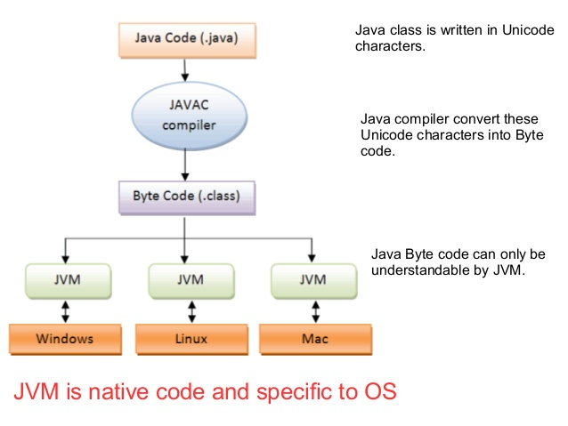
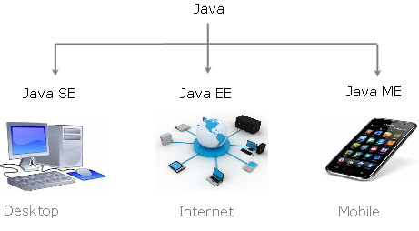
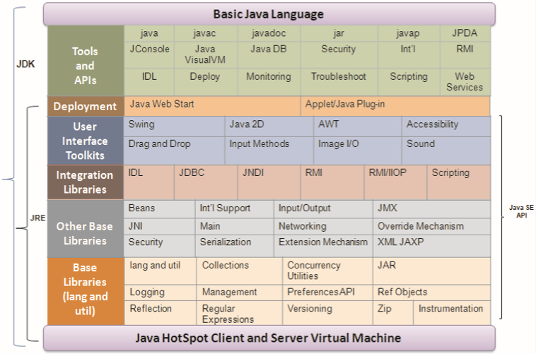
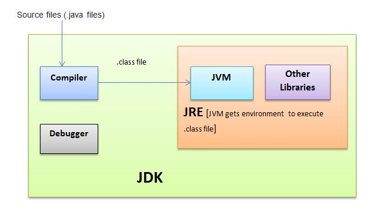
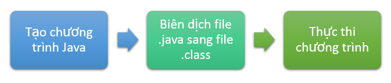

Kiến thức java cơ bản

# Tổng quan về ngôn ngữ lập trình java

## Giới thiệu

Java là một trong những ngôn ngữ lập trình hướng đối tượng. Nó được sử dụng trong phát triển phần mềm, trang web, game hay ứng dụng trên các thiết bị di động.

Java được khởi đầu bởi James Gosling và bạn đồng nghiệp ở Sun MicroSystem năm 1991. Ban đầu Java được tạo ra nhằm mục đích viết phần mềm cho các sản phẩm gia dụng, và có tên là Oak.

Java được phát hành năm 1994, đến năm 2010 được Oracle mua lại từ Sun MicroSystem.

Java được tạo ra với tiêu chí “Viết (code) một lần, thực thi khắp nơi” (Write Once, Run Anywhere  – WORA). Chương trình phần mềm viết bằng Java có thể chạy trên mọi nền tảng (platform) khác nhau thông qua một môi trường thực thi với điều kiện có môi trường thực thi thích hợp hỗ trợ nền tảng đó .

## Đặc điểm của ngôn ngữ lập trình Java

### Tương tự C++, hướng đối tượng hoàn toàn

Trong quá trình tạo ra một ngôn ngữ mới phục vụ cho mục đích chạy được trên nhiều nền tảng, các kỹ sư của Sun MicroSystem muốn tạo ra một ngôn ngữ dễ học và quen thuộc với đa số người lập trình. Vì vậy họ đã sử dụng lại các cú pháp của C và C++.

Tuy nhiên, trong Java thao tác với con trỏ bị lược bỏ nhằm đảo bảo tính an toàn và dễ sử dụng hơn. Các thao tác overload, goto hay các cấu trúc như struct và union cũng được loại bỏ khỏi Java.

### Độc lập phần cứng và hệ điều hành

Một chương trình viết bằng ngôn ngữ Java có thể chạy tốt ở nhiều môi trường khác nhau. Gọi là khả năng “cross-platform”. Khả năng độc lập phần cứng và hệ điều hành được thể hiện ở 2 cấp độ là cấp độ mã nguồn và cấp độ nhị phân.

Ở cấp độ mã nguồn: Kiểu dữ liệu trong Java nhất quán cho tất cả các hệ điều hành và phần cứng khác nhau. Java có riêng một bộ thư viện để hỗ trợ vấn đề này. Chương trình viết bằng ngôn ngữ Java có thể biên dịch trên nhiều loại máy khác nhau mà không gặp lỗi.

Ở cấp độ nhị phân: Một mã biên dịch có thể chạy trên nhiều nền tảng khác nhau mà không cần dịch lại mã nguồn. Tuy nhiên cần có Java Virtual Machine để thông dịch đoạn mã này.

### Ngôn ngữ thông dịch

Ngôn ngữ lập trình thường được chia ra làm 2 loại (tùy theo các hiện thực hóa ngôn ngữ đó) là ngôn ngữ thông dịch và ngôn ngữ biên dịch.

* Thông dịch (Interpreter) : Nó dịch từng lệnh rồi chạy từng lệnh, lần sau muốn chạy lại thì phải dịch lại.
* Biên dịch (Compiler): Code sau khi được biên dịch sẽ tạo ra 1 file thường là .exe, và file .exe này có thể đem sử dụng lại không cần biên dịch nữa.
Ngôn ngữ lập trình Java thuộc loại ngôn ngữ thông dịch. Chính xác hơn, Java là loại ngôn ngữ vừa biên dịch vừa thông dịch. Cụ thể như sau

Khi viết mã, hệ thống tạo ra một tệp .java. Khi biên dịch mã nguồn của chương trình sẽ được biên dịch ra mã byte code. Máy ảo Java (Java Virtual Machine) sẽ thông dịch mã byte code này thành machine code  (hay native code) khi nhận được yêu cầu chạy chương trình.

* Ưu điểm : Phương pháp này giúp các đoạn mã viết bằng Java có thể chạy được trên nhiều nền tảng khác nhau. Với điều kiện là JVM có hỗ trợ chạy trên nền tảng này.

* Nhược điểm : Cũng như các ngôn ngữ thông dịch khác, quá trình chạy các đoạn mã Java là chậm hơn các ngôn ngữ biên dịch khác (tuy nhiên vẫn ở trong một mức chấp nhận được).

### Cơ chế thu gom rác tự động

Khi tạo ra các đối tượng trong Java, JRE sẽ tự động cấp phát không gian bộ nhớ cho các đối tượng ở trên heap.

Với ngôn ngữ như C \ C++, bạn sẽ phải yêu cầu hủy vùng nhớ mà bạn đã  cấp phát, để tránh việc thất thoát vùng nhớ. Tuy nhiên vì một lý do nào đó, bạn không hủy một vài vùng nhớ, dẫn đến việc thất thoát và làm giảm hiệu năng chương trình.

Ngôn ngữ lập trình Java hỗ trợ cho bạn điều đó, nghĩa là bạn không phải  tự gọi hủy các vùng nhớ. Bộ thu dọn rác của Java sẽ theo vết các tài nguyên đã được cấp. Khi không có tham chiếu nào đến vùng nhớ, bộ thu dọn rác sẽ tiến hành thu hồi vùng nhớ đã được cấp phát.

### Đa luồng

Java hỗ trợ lập trình đa tiến trình (multithread) để thực thi các công việc đồng thời. Đồng thời cũng cung cấp giải pháp đồng bộ giữa các tiến trình (giải pháp sử dụng priority…).

### Tính an toàn và bảo mật

* Tính an toàn

Ngôn ngữ lập trình Java yêu cầu chặt chẽ về kiểu dữ liệu.

Dữ liệu phải được khai báo tường minh.

Không sử dụng con trỏ và các phép toán với con trỏ.

Java kiểm soát chặt chẽ việc truy nhập đến mảng, chuỗi. Không cho phép sử dụng các kỹ thuật tràn. Do đó các truy nhập sẽ không vượt quá kích thước của mảng hoặc chuỗi.

Quá trình cấp phát và giải phóng bộ nhớ được thực hiện tự động.

Cơ chế xử lý lỗi giúp việc xử lý và phục hồi lỗi dễ dàng hơn.

* Tính bảo mật

Java cung cấp một môi trường quản lý chương trình với nhiều mức khác nhau.

Mức 1 : Chỉ có thể truy xuất dữ liệu cũng như phương phức thông qua giao diện mà lớp cung cấp.

Mức 2 : Trình biên dịch kiểm soát các đoạn mã sao cho tuân thủ các quy tắc của ngôn ngữ lập trình Java trước khi thông dịch.

Mức 3 : Trình thông dịch sẽ kiểm tra mã byte code xem các đoạn mã này có đảm bảo được các quy định, quy tắc trước khi thực thi.

Mức 4: Java kiểm soát việc nạp các lớp vào bộ nhớ để giám sát việc vi phạm giới hạn truy xuất trước khi nạp vào hệ thống.

## Máy ảo Java (JVM – Java Virtual Machine)

Để đảm bảo tính đa nền, Java sử dụng cơ chế Máy ảo của Java.

ByteCode là ngôn ngữ máy của Máy ảo Java tương tự như các lệnh nhị phân của các máy tính thực.

Một chương trình sau khi được viết bằng ngôn ngữ Java (có phần mở rộng là .java) phải được biên dịch thành tập tin thực thi được trên máy ảo Java (có phần mở rộng là .class).  Tập tin thực thi này chứa các chỉ thị dưới dạng mã Bytecode mà máy ảo Java hiểu được phải làm gì.

Khi thực hiện một chương trình, máy ảo Java lần lượt thông dịch các chỉ thị dưới dạng Bytecode thành các chỉ thị dạng nhị phân của máy tính thực và thực thi thực sự chúng trên máy tính thực (còn gọi là khả năng khả chuyển).

Máy ảo thực tế đó là một chương trình thông dịch. Vì thế các hệ điều hành khác nhau sẽ có các máy ảo khác nhau. Để thực thi một ứng dụng của Java trên một hệ điều hành cụ thể, cần phải cài đặt máy ảo tương ứng cho hệ điều hành đó.

JVM cung cấp môi trường thực thi cho chương trình Java (còn gọi là khả năng độc lập với nền).

Có nhiều JVM cho các nền tảng khác nhau chẳng hạn như: Windows, Liux, và Mac.



## Các phiên bản của Java



- **Java Standard Edition (Java SE)** – Là một nền tảng cơ bản cho phép phát triển giao diện điều khiển, các ứng dụng mạng và các ứng dụng dạng Win Form.

- **Java Enterprise Edition (Java EE)** – Được xây dựng trên nền tảng Java SE, giúp phát triển các ứng dụng web, các ứng dụng ở cấp doanh nghiệp, …

- **Java Mobile Edition (Java ME)** – Là một nền tảng cho phép phát triển các ứng dụng nhúng vào các thiết bị điện tử như mobile,…

## Các thành phần của Java SE Platform

Gồm 2 thành phần:

- **JRE (Java Runtime Environment)**: cung cấp JVM  (Java Virtual Machine) và thư viện được sử dụng để chạy chương trình Java.
- **JDK (Java Development Kit)**: được biết đến như bộ cung cụ phát triển Java, bao gồm: trình biên dịch và trình gỡ rối được sử dụng để phát triển các ứng dụng Java.



## Phân biệt JVM, JRE, JDK

Trong bài này, chúng ta sẽ tìm hiểu về JVM, JRE, JDK. Nó bao gồm những thành phần nào và nhiệm vụ của nó là gì?



### JVM (Java Virtual Machine) 

là tạo ra môi trường máy ảo để thực thi mã java bytecode.

* Máy ảo Java là phần mềm giả lập máy tính, nó tập hợp các lệnh logic để xác định hoạt động của máy.
* Có thể xem nó như là một hệ điều hành thu nhỏ.
* JVM chuyển mã byte code thành machine code tùy theo môi trường tương ứng (gọi là khả năng khả chuyển)
* JVM cung cấp môi trường thực thi cho chương trình Java (gọi đó là khả năng độc lập với nền).

### JRE

JRE viết tắt Java Runtime Enviromement. Nó bao gồm các thư viện và các file mà JVM sử dụng lúc thực thi.

### JDK

JDK viết tắt của Java Development Kit. Nó gồm JRE + công cụ phát triển.

Bộ công cụ JDK gồm các chương trình thực thi đáng chú ý sau:

* **javac**: Chương trình biên dịch các chương trình nguồn viết bằng ngôn ngữ java ra các tập tin thực thi được trên máy ảo Java.
* **java**: Một chương trình để dịch mã mà bạn viết thành mã bytecode, khi ứng dụng Java chạy nó dịch mã bytecode thành mã máy tính và thực thi, điều đó có nghĩa là bytecode chỉ là một mã trung gian.Đây là chương trình làm máy ảo của Java, thông dịch mã Bytecode của các chương trình kiểu application thành mã thực thi của máy thực.
* **Archive (jar)**: Là một chương trình nén các file thành một file duy nhất có đuôi jar. Thường dùng để đóng gói các file class.
* **Javadoc**: Là một công cụ tạo ra tài liệu hướng dẫn sử dụng API.
appletviewer: Bộ thông dịch, thực thi các chương trình kiểu applet.
* **javadoc**: Tạo tài liệu về chú thích chương trình nguồn một cách tự động.
* **jdb**: Trình gở rối.
* **rmic**: Tạo Stub cho ứng dụng kiểu RMI.
* **rmiregistry**: Phục vụ danh bạ (Name Server) trong hệ thống RMI

## Chương trình Java



- B1: viết chương trình Java

- B2: Trình biên dịch (compiler) sẽ làm nhiệm vụ chuyển mã nguồn sang mã bytecodes để máy ảo (JVM) có thể hiểu được.

```cmd
javac <Tên class>.java
```

- B3: Thực thi chương trình đã biên dịch

```cmd
java <Tên class> [ThamSo1 ThamSo2 …]
```