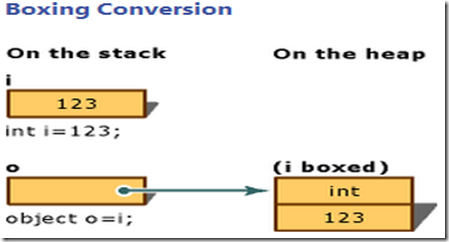
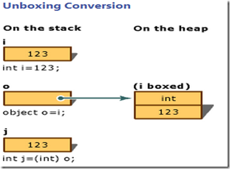
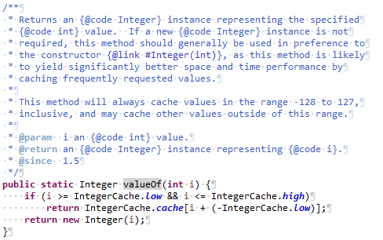
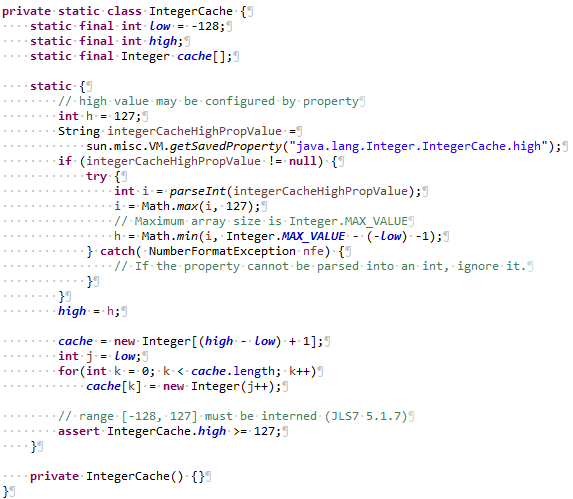
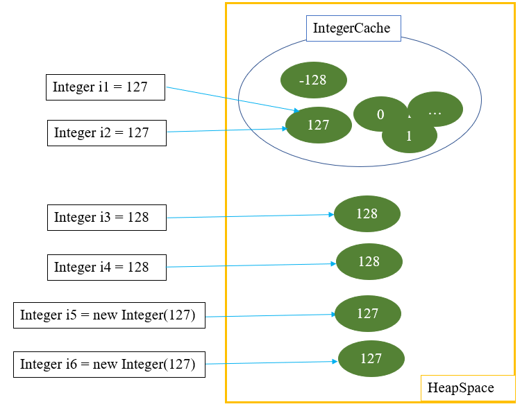

# Ngôn ngữ lập trình JAVA

## Biến trong java

Trong java, biến là tên của vùng nhớ. Có 3 kiểu biến trong java, bao gồm biến biến cục bộ (local ), biến biến toàn cục (instance) và biến tĩnh (static).

### Biến (variables) là gì?

Biến là vùng nhớ dùng để lưu trữ các giá trị của chương trình. Mỗi biến gắn liền với một kiểu dữ liệu và một định danh duy nhất gọi là tên biến.

Cú pháp khai báo biến:

```java
DataType varName [ = value] [, varName2] [ = value2]…;
```
Trong đó, DataType là kiểu dữ liệu của biến, varName là tên biến.

### Biến cục bộ (local)

- Biến local được khai báo trong các phương thức, hàm contructor hoặc trong các block.
- Biến local được tạo bên trong các phương thức, contructor, block và sẽ bị phá hủy khi kết thúc các phương thức, contructor và block.
- Không được sử dụng “access modifier” khi khai báo biến local.
- Các biến local được lưu trên vùng nhớ stack của bộ nhớ.
- Bạn cần khởi tạo giá trị mặc định cho biến local trước khi có thể sử dụng.

### Biến toàn cục (instance)

- Biến instance được khai báo trong một lớp(class), bên ngoài các phương thức, constructor và các block.
- Biến instance được lưu trong bộ nhớ heap.
- Biến instance được tạo khi một đối tượng được tạo bằng việc sử dụng từ khóa “new” và sẽ bị phá hủy khi đối tượng bị phá hủy.
- Biến instance có thể được sử dụng bởi các phương thức, constructor, block, … Nhưng nó phải được sử dụng thông qua một đối tượng cụ thể.
- Bạn được phép sử dụng “access modifier” khi khai báo biến instance, mặc định là “default”.
- Biến instance có giá trị mặc định phụ thuộc vào kiểu dữ liệu của nó. Ví dụ nếu là kiểu int, short, byte thì giá trị mặc định là 0, kiểu double thì là 0.0d, … Vì vậy, bạn sẽ không cần khởi tạo giá trị cho biến instance trước khi sử dụng.
- Bên trong class mà bạn khai báo biến instance, bạn có thể gọi nó trực tiếp bằng tên khi sử dụng ở khắp nới bên trong class đó.

### Biến tĩnh (static)

- Biến static được khai báo trong một class với từ khóa “static”, phía bên ngoài các phương thức, constructor và block.
- Sẽ chỉ có duy nhất một bản sao của các biến static được tạo ra, dù bạn tạo bao nhiêu đối tượng từ lớp tương ứng.
- Biến static được lưu trữ trong bộ nhớ static riêng.
- Biến static được tạo khi chương trình bắt đầu chạy và chỉ bị phá hủy khi chương trình dừng.
- Giá trị mặc định của biến static phụ thuộc vào kiểu dữ liệu bạn khai báo tương tự biến instance.
- Biến static được truy cập thông qua tên của class chứa nó, với cú pháp: TenClass.tenBien.
- Trong class, các phương thức sử dụng biến static bằng cách gọi tên của nó khi phương thức đó cũng được khai báo với từ khóa “static”.

### Hằng

- Hằng là một giá trị bất biến trong chương trình
- Sử dụng từ khóa **final** để khai báo hằng số

## Các kiểu dữ liệu trong java

Trong Java, kiểu dữ liệu được chia làm hai loại: kiểu dữ liệu nguyên thủy (primitive) và kiểu đối tượng (object). Thông thường, để phân biệt 2 kiểu này ta dựa vào tên của nó. Kiểu nguyên thủy có tên bắt đầu bằng chữ thường, các kiểu đối tượng có tên bắt đầu bằng chữ hoa. Ví dụ: int, double là kiểu nguyên thủy, Integer, Double là kiểu đối tượng.

### Kiểu dữ liệu nguyên thủy (primitive)

Có 8 loại dữ liệu nguyên thủy (primitive data) trong JAVA:
- Kiểu số nguyên: byte, short, int, long
- Kiểu số thực: float, double
- Kiểu ký tự: char
- Kiểu logic: trả về giá trị true hoặc false (đúng hoặc sai).

Kiểu dữ liệu | 	Số bit | Giá trị nhỏ nhất | Giá trị lớn nhất
------------ | ------------- | ------------- | -------------
byte |	8	| -128 (-2^7) |	127 (2^7-1) |
short |	16 |	-32,768 (-2^15) |	32,767 (2^15 -1) |
int |	32 |	– 2,147,483,648(-2^31) |	2,147,483,647(2^31 -1) |
long |	64 |	-9,223,372,036,854,775,808(-2^63) |	9,223,372,036,854,775,807(2^63 -1) |
float |	32 |	-3.4028235 x 10^38 |	3.4028235 x 10^38 |
double |	64 |	-1.7976931348623157 x 10^308 |	1.7976931348623157 x 10^308 |
boolean |	false |	true |
char  |	16 |	‘\u0000’ (0) |	‘\uffff’ (65,535). |

### Kiểu dữ liệu đối tượng

Trong java có 3 kiểu dữ liệu đối tượng:

- Array:	Một mảng của các dữ liệu cùng kiểu.
- Class :	Dữ liệu kiểu lớp đối tượng do người dùng định nghĩa. Chứa tập các thuộc tính và phương thức..
- Interface:	Dữ liệu kiểu lớp giao tiếp do người dùng định nghĩa. Chứa các phương thức của giao tiếp

### Lớp Wrapper trong java

#### Giới thiệu lớp Wrapper

Lớp Wrapper trong java cung cấp cơ chế để chuyển đổi kiểu dữ liệu nguyên thủy thành kiểu đối tượng và ngược lại từ đối tượng thành kiểu dữ liệu nguyên thủy.

Kiểu nguyên thủy |	Kiểu Wrapper
------------ | -------------
boolean |	Boolean
char |	Character
byte |	Byte
short |	Short
int |	Integer
long  |	Long
float |	Float
double |	Double

#### Tại sao cần Wrapper class

- Với kiểu dữ liệu nguyên thủy, các giá trị có thể được khởi tạo với giá trị mặc định 0, false, … điều này có thể  không chính xác hoặc gây nhầm lẫn cho lập trình viên.
- Cần sử dụng các biến có giá trị Null.
- Có thể sử dụng lớp Wrapper trong Collection.
- Với wrapper chúng ta có thể nhận được NullPointerException khi một cái gì đó đang được thiết lập không chính xác. Đôi khi nó giúp chúng ta dễ dàng phát hiện lỗi hơn.

#### Hạn chế của Wrapper class

- Các kiểu dữ liệu nguyên thủy có thể nhanh hơn nhiều so với các lớp Wrapper tương ứng.
- Phép toán so sánh == có thể cho kết quả không như mong đợi:
    - == so sánh tham chiếu (reference)
    - .equal() so sánh các giá trị (value)

#### Nên lựa chọn kiểu dữ liệu nguyên thủy (primitive type) hay Wrapper Class

- Nói chung, bạn nên sử dụng các kiểu nguyên thủy trừ khi bạn cần một đối tượng vì một số lý do (ví dụ sử dụng trong Collection, có thể lưu giá trị Null).
- Có một số cấu trúc nhất định như Collection bắt buộc phải sử dụng đổi tượng lớp Wrapper. Lưu ý, các đối tượng tốn nhiều chi phí hơn so với các dữ liệu kiểu nguyên thủy của chúng.
- Nếu bạn vẫn cần wrapper, hãy xem xét một cách tiếp cận khác mà không yêu cầu đối tượng nếu bạn muốn tối đa hóa hiệu suất dữ liệu.
- Chúng ta cũng phải xem xét rằng autoboxing của lớp wrapper không làm giảm việc tạo object, nhưng nó làm giảm sự phức tạp của code.

### Autoboxing và Unboxing trong Java

Autoboxing là quá trình mà trình biên dịch của Java tự động chuyển đổi giữa kiểu dữ liệu cơ bản (Primitive type) về đối tượng tương ứng với lớp (Wrapper class) của kiểu dữ liệu đó. Ví dụ, trình biên dịch sẽ chuyển đổi kiểu dữ liệu int sang Integer, kiểu double sang Double, …Và ngược lại là unboxing. Đây là tính năng mới của Java 5.

#### Quá trình Autoboxing

Autoboxing hay Boxing là quá trình chuyển dữ liệu từ kiểu tham trị sang kiểu tham chiếu. Quá trình boxing một biến kiểu tham trị sẽ khởi tạo một đối tượng trong vùng nhớ Heap và copy giá trị của biến tham trị vào đối tượng mới này. Và quá trình boxing được thực hiện nhờ quá trình chuyển đổi ngầm định.



#### Quá trình Autoboxing

Unboxing là quá trình ngược lại với Boxing, tức là đưa từ kiểu tham chiếu ra kiểu tham trị. Quá trình này sẽ được thực hiện một cách tường minh. Gồm có 2 bước :

– Bước 1 : Kiểm tra chắc chắn rằng đối tượng đã được boxing đúng kiểu giá trị đưa ra.

– Bước 2 : Copy giá trị sang biến dữ liệu kiểu tham trị.



#### So sánh Autoboxing và Unboxing

Trong java có 2 kiểu dữ là: kiểu dữ liệu nguyên thủy (Primitivies type) như int, double… và kiểu dữ liệu tham chiếu (parameter) như các Wraper class: Integer, Double…
Các wrapper class là các đối tượng, do vậy khi ta ”khai báo kiểu Wrapper”  thì giá trị mặc định được gán là null, còn đối với kiểu “khai báo kiểu nguyên thuỷ” thì giá trị mặc định được gán là 0.

Java tự động thực hiện autoboxing để chuyển đổi (convert) Primitivites type về Wrapper class tương ứng. Do đó, với kiểu “khai báo kiểu Wrapper”  thì nó đã là là một wrapper class rồi, không cần bước convert nữa, do đó hiệu suất thực hiện của chương trình sẽ cao hơn kiểu “khai báo kiểu nguyên thuỷ”.

#### Ví dụ về Autoboxing trong java

```java
public class BoxingSample {
    public static void main(String args[]) {
        int num = 1;
        Integer obj1 = new Integer(num);// Boxing
        Integer obj2 = 2;             // Boxing
    }
}
```

#### Ví dụ về Unboxing trong java

```java
public class UnboxingSample {
    public static void main(String args[]) {
        Integer obj = new Integer(1);
        int num = obj ; // unboxing
    }
}
```

## Enum 

enum là một từ khóa trong Java, là một kiểu dữ liệu đặc biệt được sử dụng để đại diện cho hằng số cố định.

Một enum có thể chứa các trường, phương thức và constructor.

Bởi vì các giá trị của Enum là các hằng số, nên tên của các trường kiểu enum thường là các chữ cái hoa.

Trong ngôn ngữ lập trình Java, bạn xác định một kiểu enum bằng cách sử dụng từ khóa enum. Ví dụ, sử dụng enum để định nghĩa các ngày trong tuần (SUNDAY, MONDAY, TUESDAY, WEDNESDAY, THURSDAY, FRIDAY, SATURDAY), các mùa trong năm (SPRING, SUMMER, FALL, WINTER), …

## Integer 

Lớp Integer wrap (bao đóng) một giá trị của kiểu int nguyên thủy (primitive) trong một đối tượng. Một đối tượng kiểu Integer chứa một trường duy nhất có kiểu là int.

Ngoài ra, lớp này cung cấp một số phương thức để chuyển đổi một int đến một String và một String đến một int, cũng như các hằng số và phương thức hữu ích khi thao tác với một giá trị kiểu int.

### So sánh dữ liệu kiểu Integer

Hãy xem ví dụ bên dưới:

```java
public class IntegerCompare {
 
    public static void main(String[] args) {
        Integer i1 = 127;
        Integer i2 = 127;
         
        Integer i3 = 128;
        Integer i4 = 128;
 
        Integer i5 = new Integer(127);
        Integer i6 = new Integer(127);
         
        int i7 = 127;
         
        System.out.println(i1 == i2); // = true
        System.out.println(i3 == i4); // = false
        System.out.println(i5 == i6); // = false
        System.out.println(i1 == i5); // = false
        System.out.println(i1 == i7); // = true
    }
 
}
```

Java gọi phương thức Integer.valueOf() bất cứ khi nào chúng ta tạo đối tượng lớp Integer, ví dụ: Integer i1 = 127 , tương đương với Integer i1 = Integer.valueOf(127) .

Hãy xem code của phương thức Integer.valueOf() được cài đặt bên trong JDK:



Như bạn thấy, phương thức Integer.valueOf() trả về một thể hiện Integer đại diện cho giá trị int được chỉ định.

Nếu một giá trị kiểu int nằm trong khoảng Integer.low và Integer.high thì đối tượng Integer được trả về từ Integer.cache. Trường hợp ngược lại, khởi tạo đối tượng Integer mới, đại diện cho giá trị int được chỉ định.

Xem tiếp nội dung của lớp IntegerCache:



Integer.cache lưu trữ bộ nhớ đệm (cache) các giá trị Integer. Như bạn thấy giá, mặc định giá trị high = 127, low = -128, nên các giá trị được cache trong khoảng từ -128 đến 127. Chúng ta có thể thay đổi giá trị high bằng cách thêm cấu hình JVM:

-Djava.lang.Integer.IntegerCache.high=<size> hoặc
-XX:AutoBoxCacheMax=<size>

Kết quả của ví dụ trên, có thể được giải thích thông qua hình bên dưới:



Khi so sánh bằng toán tử == nghĩa là ta so sánh địa chỉ của vùng nhớ. Trường hợp i1 và i2 cùng tham chiếu đến 1 vùng nhớ nên kết quả là true, các trường hợp khác do không cùng vùng nhớ nên kết quả là false. Trường hợp i1 == i7 có kết quả là true, lý do một kiểu Integer Wrapper khi so sánh == với một kiểu int primitive type thì JVM sẽ sử dụng cơ chế Unboxing để chuyển kiểu Wrapper về kiểu primitive tương ứng.

Lưu ý: để so sánh giá trị của 2 đối tượng kiểu Integer chúng ta nên sử dụng phương thức equals() để so sánh hoặc chuyển đổi về kiểu primitive tương ứng trước khi thực hiện so sánh ==.
