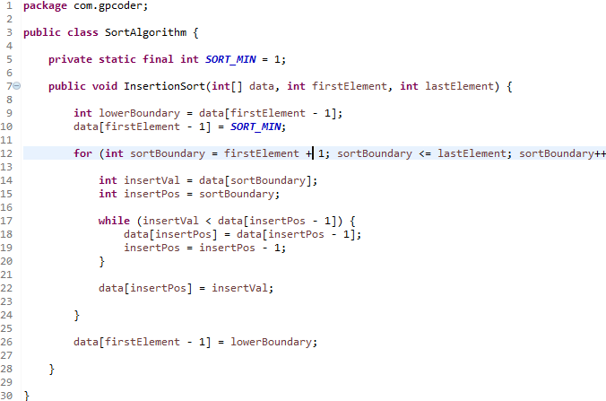

# Tiêu chuẩn coding trong Java (Coding Standards)

## Chuẩn hình thức và chuẩn ngữ nghĩa

### Chuẩn hình thức

Là những quy định liên quan đến sự định dạng của mã nguồn:

- Thụt đầu dòng
- Sử dụng khoảng trắng
- Đóng ngoặc, mở ngoặc
- Đặt tên lớp, thuộc tính, phương thức

### Chuẩn ngữ nghĩa

Là những quy định liên quan đến sự thực thi của mã nguồn

- Biểu thức so sánh
- Cấu trúc điều khiển : if, for, while
- Khai báo và sử dụng biến
- Cài đặt phương thức

## White Space

Những quy định về sử dụng khoảng trắng (space), thụt đầu dòng, xuống dòng, dòng trống: giúp cho nội dung văn bản được tổ chức một cách có hệ thống để người đọc dễ dàng tiếp thu.

### White Space – thụt đầu dòng

Xác định một chuẩn thụt đầu dòng cho toàn bộ mã nguồn của chương trình.

- 1 đơn vị thụt đầu dòng = 1 tab(*)

### White Space – Dòng trống

Những dòng code có quan hệ với nhau (cùng thực hiện một công việc) thì gom lại thành một block.

Nghĩa là không có dòng trống giữa các đoạn code.

Hai block code thì cách nhau ít nhất một dòng trống.

Đặt khoảng trắng sau dấu phẩy và dấu chấm phẩy.

Đặt khoảng trắng xung quanh các toán tử.

## Quy ước đặt tên

### Quy tắc viết hoa

#### Pascal case

- Các chữ cái đầu mỗi từ được viết hoa.
- Các chữ còn lại được viết thường.
- Ví dụ: **MyProvider**, **StringBuilder**

#### Camel case

Giống với Pascal case nhưng chữ cái đầu của từ đầu tiên viết thường.
Ví dụ: **myProvider**, **stringBuilder**

### Đặt tên class,  interface, abstract class

- Sử dụng danh từ hay cụm danh từ : **SinhVien**, **FormSinhVien**,…

- Dùng Pascal case : **SinhVien**, **FormSinhVien**,…

Hạn chế viết tắt gây khó hiểu :

- Sai: **FormSV** | Đúng:**FormSinhVien**

Không dùng tiền tố khi đặt tên lớp:

- Sai : **ISinhVien**   | Đúng: **SinhVien**

### Phương thức

- Sử dụng Camel case để đặt tên phương thức. Ví dụ: **xepLoai**.

- Tên phương thức thể hiện được chức năng của phương thức đó. **tinhDiemTrungBinh**.

- Tránh đặt tên gây cảm giác mơ hồ, không rõ nghĩa. Ví dụ: **hienThi**, **tinh**.

- Không phân biệt tên các phương thức bằng số. Ví dụ: **tinhDiem1**, **tinhDiem2**.

### Biến

- Sử dụng Camel case để đặt tên biến. Ví dụ: int **diemTrungBinh**, String **hoTen**

- Không dùng tiền tố. Ví dụ:

Đúng: String **address**
Sai: String **strAddress**
Tên biến gợi nhớ, tránh viết tắt gây khó hiểu. Ví dụ:

Đúng: String **address**
Sai: String **addr**
Không đặt tên biến chỉ bằng 1 chữ cái như x, y , z,… trừ trường hợp các biến đếm i, j, k.

- Không nên đặt tên biến quá dài, hay quá ngắn vì có thể làm rối chương trình hoặc cũng dẫn đến ý nghĩa biến mơ hồ(quá ngắn).

### Biến static, enum

Tất cả các từ được viết hoa và phân cách bằng dấu gạch dưới (_). VD:

- static float PI = 3.14f
- static int MIN_WIDTH = 4

### Biến final

Đối với biến final toàn cục: đặt tên biết giống như biến static. Tất cả các từ được viết hoa và phân cách bằng dấu gạch dưới (_).

### Đặt tên package

Tên package: tất cả đều là chữ thường. VD:

- Đúng: com.example.deepspace
- Sai: com.example.deepSpace hoặc com.example.deep_space

