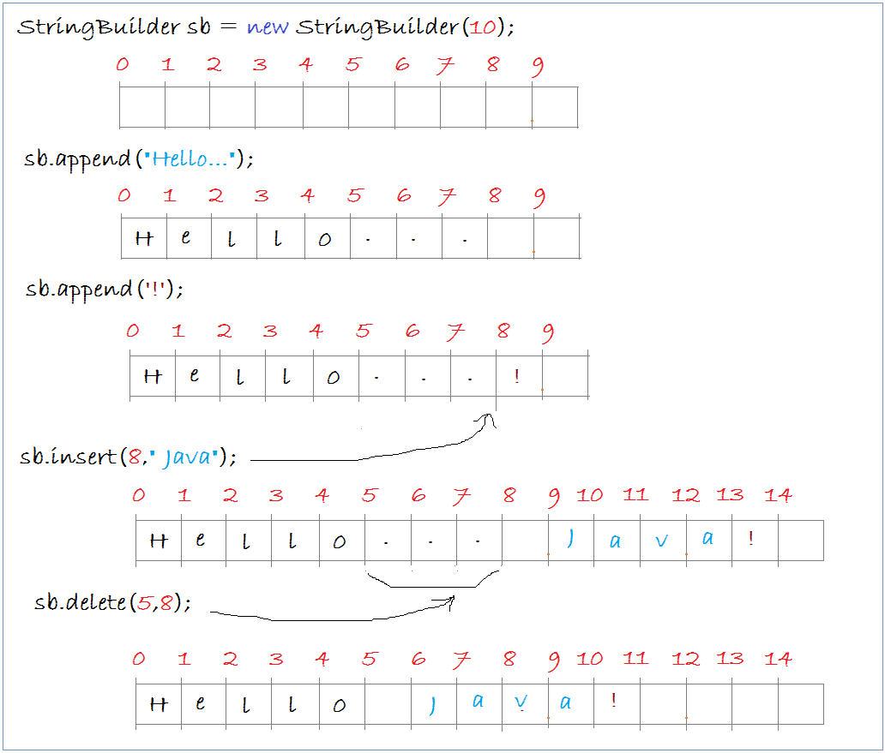

# Hướng dẫn sử dụng Java String, StringBuffer và StringBuilder

Khi làm việc với các dữ liệu văn bản, Java cung cấp cho bạn 3 class String, StringBuffer và StringBuilder. Nếu làm việc với các dữ liệu lớn bạn nên sử dụng StringBuffer hoặc StringBuilder để đạt hiệu năng nhanh nhất. Về cơ bản 3 class này có nhiều điểm giống nhau.

- String là không thể thay đổi (immutable – khái niệm này sẽ được nói chi tiết ở trong phần tiếp theo của bài viết này) và không cho phép có class con.
- StringBuffer, StringBuilder có thể thay đổi (mutable)

StringBuilder và StringBuffer là giống nhau, nó chỉ khác biệt tình huống sử dụng có liên quan tới đa luồng (Multi Thread).

- Nếu xử lý văn bản sử dụng nhiều luồng (Thread) bạn nên sử dụng StringBuffer để tránh tranh chấp giữa các luồng.
- Nếu xử lý văn bản sử dụng 1 luồng (Thread) nên sử dụng StringBuilder.

Nếu so sánh về tốc độ xử lý StringBuilder là tốt nhất, sau đó StringBuffer và cuối cùng mới là String

## Khái niệm mutable & immutable

**Mutable Object**: khi khởi tạo 1 đối tượng, tức ta có 1 tham chiếu tới 1 thể hiện của 1 lớp, thì trạng thái của đối tượng có thể thay đổi được sau khi việc khởi tạo đối tượng thành công. Trạng thái đối tượng ở đây có thể là các trường thông tin mà đối tượng đó nắm giữ. Ví dụ: tên, tuổi của 1 đối tượng sinh viên chẳng hạn. Điều này có nghĩa là, bạn vừa có thể get() vừa có thể set() giá trị.

**Immutable Object**: khi khởi tạo 1 đối tượng, thì trạng thái của tối tượng đó không thể thay đổi được sau khi việc khởi tạo đối tượng thành công. Điều này có nghĩa là, bạn chỉ có thể get() mà không thể set().

Ví dụ:

```java
// Đây là một class với trường value, name.
// Khi bạn khởi tạo đối tượng class này
// bạn không thể sét đặt lại value từ bên ngoài, và tất cả các trường khác của nó cũng thế.
// Class này không hề có các hàm để sét đặt lại các trường (field) từ bên ngoài.
// Nếu muốn bạn chỉ có thể tạo mới một đối tượng khác.
// Điều đó có nghĩa là class này là không thể thay đổi (immutable)
public class ImmutableClassExample  {
    private final int value;
    private final String name;
  
    public ImmutableClassExample(String name, int value)  {
           this.value = value;
           this.name= name;
    }
   
    public String getName()  {
           return name;
    }
  
    public int getValue()  {
          return value;
    }
}
  
  
// Đây là một class có 1 trường value.
// Sau khi khởi tạo đối tượng bạn có thể sét đặt lại giá trị của trường value
// thông qua việc gọi method setNewValue(int).
// Như vậy đây là class có thể thay đổi (mutable).
public class MutableClassExample  {
  
      private int value;
  
      public MutableClassExample(int value)  {
            this.value= value;
      }
  
      public void setNewValue(int newValue)  {
           this.value = newValue;
      }
  
}
```

String là một class không thể thay đổi, String có nhiều thuộc tính (trường), ví dụ length,… nhưng các giá trị đó là không thể thay đổi.

## String

Trong java, String là một class đặc biệt, nguyên nhân là nó được sử dụng một cách thường xuyên trong một chương trình, vì vậy đòi hỏi nó phải có hiệu suất và sự mềm dẻo. Đó là lý do tại sao String có tính đối tượng và vừa có tính nguyên thủy (primitive).

### Tính nguyên thủy:

Bạn có thể tạo một string literal (chuỗi chữ), string literal được lưu trữ trong ngăn sếp (stack), đòi hỏi không gian lưu trữ ít, và rẻ hơn khi thao tác.

- String literal = “Hello World”;

Bạn có thể sử dụng toán tử + để nối 2 string, toán tử này vốn quen thuộc và sử dụng cho các kiểu dữ liệu nguyên thủy int, float, double.
Các string literal được chứa trong một bể chứa (common pool). Như vậy hai string literal có nội dung giống nhau sử dụng chung một vùng bộ nhớ trên stack, điều này giúp tiết kiệm bộ nhớ.

### Tính đối tượng

Vì String là một class, vì vậy nó có thể được tạo ra thông qua toán tử new.

 - String object = new String(“Hello World”);

Các đối tượng String được lưu trữ trên Heap, yêu cầu quản lý bộ nhớ phức tạp và tốn không gian lưu trữ. Hai đối tượng String có nội dung giống nhau lưu trữ trên 2 vùng bộ nhớ khác nhau của Heap.

Ví dụ:

```java
String s1 = "Hello";              // String literal
String s2 = "Hello";              // String literal
String s3 = s1;                   // Cùng tham chiếu (trỏ tới cùng một vị trí)
String s4 = new String("Hello");  // Tạo mới một đối tượng String
String s5 = new String("Hello");  // Tạo mới một đối tượng String
```

Như đã đề cập, có hai cách để xây dựng một chuỗi (String): ngầm xây dựng bằng cách chỉ định một chuỗi chữ ( String literal) hay một cách rõ ràng tạo ra một đối tượng String thông qua toán tử new và cấu tử của String. 

Chúng ta sẽ giải thích bằng hình minh họa dưới đây:


Các string literal có cùng một nội dung, chúng sẽ chia sẻ cùng một vị trí lưu trữ trong bể chứa ( common pool). Trong khi đó các đối tượng String lưu trữ trong Heap, và không chia sẻ vị trí lưu trữ kể cả 2 đối tượng string này có nội dung giống nhau.

### So sánh equals() và ==

Phương thức equals() sử dụng để so sánh 2 đối tượng, với String nó có ý nghĩa là so sánh nội dung của 2 string. Đối với các kiểu tham chiếu (reference) toán tử == có ý nghĩa là so sánh địa chỉ vùng bộ nhớ lưu trữ của đối tượng. Hãy xem ví dụ:

```java
String s1 = "Hello"; // String literal
String s2 = "Hello"; // String literal
String s3 = s1; // Cùng tham chiếu (trỏ tới cùng một vị trí)
String s4 = new String("Hello"); // Tạo mới một đối tượng String
String s5 = new String("Hello"); // Tạo mới một đối tượng String
  
s1 == s1; // true, cùng trỏ vào một vị trí
s1 == s2; // true, s1 và s2 cùng trỏ tới 1 ví trí trong "bể chứa" (common pool)
s1 == s3; // true, s3 được gán bởi s1, nó sẽ trỏ tới vị trí s1 trỏ tới.
s1 == s4; // false, trỏ tới khác vị trí.
s4 == s5; // false, trỏ tới khác vị trí trên heap
  
s1.equals(s3); // true, cùng nội dung
s1.equals(s4); // true, cùng nội dung
s4.equals(s5); // true, cùng nội dung
```

Trong thực tế bạn nên sử dụng String literal, thay vì sử dụng toán tử new. Điều này làm tăng tốc chương trình của bạn.

## StringBuffer vs StringBuilder

StringBuilder và StringBuffer là rất giống nhau, điều khác biệt là tất cả các phương thức của StringBuffer đã được đồng bộ, nó thích hợp khi bạn làm việc với ứng dụng đa luồng, nhiều luồng có thể truy cập vào một đối tượng StringBuffer cùng lúc. Trong khi đó StringBuilder có các phương thức tương tự nhưng không được đồng bộ, nhưng vì vậy mà hiệu suất của nó cao hơn, bạn nên sử dụng StringBuilder trong ứng dụng đơn luồng, hoặc sử dụng như một biến địa phương trong một phương thức.

### Các method của StringBuffer (StringBuilder cũng tương tự)

```java
// Cấu tử.
StringBuffer() // an initially-empty StringBuffer
StringBuffer(int size) // with the specified initial size
StringBuffer(String s) // with the specified initial content
  
// Độ dài
int length()
  
// Các method xây dựng nội dung
// type ở đây có thể là kiểu nguyên thủy (primitive), char[], String, StringBuffer, .v.v..
StringBuffer append(type arg) // ==&gt; chú ý (ở trên)
StringBuffer insert(int offset, type arg) // ==&gt; chú ý (ở trên)
  
// Các method thao tác trên nội dung.
StringBuffer delete(int start, int end)
StringBuffer deleteCharAt(int index)
void setLength(int newSize)
void setCharAt(int index, char newChar)
StringBuffer replace(int start, int end, String s)
StringBuffer reverse()
  
// Các method trích ra toàn bộ hoặc một phần dữ liệu.
char charAt(int index)
String substring(int start)
String substring(int start, int end)
String toString()
  
// Các method tìm kiếm vị trí.
int indexOf(String searchKey)
int indexOf(String searchKey, int fromIndex)
int lastIndexOf(String searchKey)
int lastIndexOf(String searchKey, int fromIndex)
```

### Ví dụ minh họa



```java
public class StringBuilderDemo {
  
  public static void main(String[] args) {
  
      // Tạo đối tượng StringBuilder
      // Hiện tại chưa có dữ liệu trên StringBuilder.
      StringBuilder sb = new StringBuilder(10);
       
      // Nối thêm chuỗi Hello vào sb.
      sb.append("Hello...");
      System.out.println("- sb after appends a string: " + sb);
  
      // append a character
      char c = '!';
      sb.append(c);
      System.out.println("- sb after appending a char: " + sb);
  
      // Trèn một String vào vị trí thứ 5
      sb.insert(8, " Java");
      System.out.println("- sb after insert string: " + sb);
       
      // Xóa đoạn String con trên StringBuilder.
      // Tại vị trí có chỉ số 5 tới 8
      sb.delete(5,8);
  
      System.out.println("- sb after delete: " + sb);
  }
}
/**
Kết quả:
- sb after appends a string: Hello...
- sb after appending a char: Hello...!
- sb after insert string: Hello... Java!
- sb after delete: Hello Java!
**/
```


