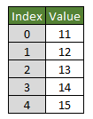
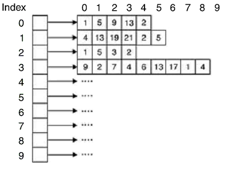
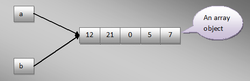

# Mảng (Array)

## Mảng là gì?

Mảng (array) trong Java là một tập hợp các phần tử có cùng kiểu dữ liệu, có địa chỉ tiếp nhau trên bộ nhớ (memory). Mảng có số phần tử cố định và bạn không thể thay đổi kích thước của nó.

Kiểu dữ liệu trong mảng có thể là kiểu nguyên thủy (primitive type) hoặc kiểu đối tượng (object).

Mảng trong Java là dựa trên chỉ mục (index), phần tử đầu tiên của mảng được lưu trữ tại chỉ mục 0.

## Mảng một chiều

### Khai báo biến mảng trong Java

Khai báo một mảng, chưa chỉ rõ số phần tử:

Cú pháp:

```java
Kieu_du_lieu[] ten_bien;
```

Kieu_du_lieu có thể là kiểu nguyên thủy (primitive) hoặc kiểu đối tượng (object).

Ví dụ: int[] arr;

### Khởi tạo số lượng phần tử của mảng

```java
ten_bien = new Kieu_du_lieu[kich_thuoc_mang];
```

### Ví dụ sử dụng mảng

```java
package com.gpcoder;
 
public class ArraySample1 {
   
  public static void main(String[] args) {
 
      // Khai báo một mảng 5 phần tử
      int[] arr = new int[5];
 
      // Chú ý: phần tử đầu tiên của mảng có chỉ số là 0:
      // Gán giá trị cho phần tử đầu tiên (Chỉ số 0)
      arr[0] = 11;
 
      // Gán giá trị cho phần tử thứ hai (Chỉ số 1)
      arr[1] = 12;
 
      arr[2] = 13;
      arr[3] = 14;
      arr[4] = 15;
 
      // In ra màn hình Console số phần tử của mảng.
      System.out.println("Số lượng phần tử = " + arr.length);
 
      // Kiểm tra nếu số lượng phần từ của mảng >= 2 thì hiển thị giá trị của phần tử thứ 2
      if (arr.length >= 2) {
        // In ra phần tử tại chỉ số 1 (Phần tử thứ 2 trong mảng)
        System.out.println(" arr[1]=" + arr[1]);
      }
 
      // Sử dụng vòng lặp for để in ra các phần tử trong mảng.
      System.out.println("Sử dụng for");
      for (int index = 0; index < arr.length; index++) {
          System.out.println("Element " + index + " = " + arr[index]);
      }
 
      // Sử dụng vòng lặp foreach để in ra các phần tử trong mảng.
      System.out.println("Sử dụng foreach");
      int index = 0;
      for (int value : arr) {
          System.out.println("Element " + index + " = " + value);
          index++;
      }
  }
 
}
```

### Các phương thức tiện ích cho mảng 1 chiều (Arrays)

```java
// Chuyển một mảng có kiểu T sang danh sách (List) có kiểu T
// T là kiểu đối tượng (Object)
public static <T> List<T> asList(T... a)
   
// Tìm kiếm chỉ số của một giá trị xuất hiện trong mảng.
// (Sử dụng thuật toán tìm kiếm nhị phân (binary search))
public static int binarySearch(type[] a, type key)
 
// Sắp xếp các giá trị của mảng tăng dần
public static void sort(type[] a)
  
// Copy các phần tử của một mảng để tạo ra một mảng mới với độ dài chỉ định.
public static int[] copyOf(type[] original, type newLength)
  
// Copy một phạm vi chỉ định các phần tử của mảng để tạo một mảng mới
public static double[] copyOfRange(type[] original, int from, int to)
  
// So sánh hai mảng
public static boolean equals(type[] a, long[] a2)
  
// Gán cùng một giá trị cho tất cả các phần tử của mảng.
public static void fill(type[] a, type val)
  
// Chuyển một mảng thành chuỗi (string)
public static String toString(type[] a)
```

## Mảng hai chiều

### Khai báo mảng 2 chiều

```java
Có 3 cách để khai báo một mảng 2 chiều:

// Khai báo một mảng có 5 dòng, 10 cột
Kieu_du_lieu[][] ten_bien_1 = new Kieu_du_lieu[5][10]; 
  
// Khai báo một mảng 2 chiều có 5 dòng.
// (Mảng của mảng)
Kieu_du_lieu[][] ten_bien_2 = new Kieu_du_lieu[5][]; 
  
// Khai báo một mảng 2 chiều, chỉ định giá trị các phần tử. 
Kieu_du_lieu[][] ten_bien_3 = new Kieu_du_lieu[][] {
  
    { value00, value01, value02 }, 
    { value10, value11, value12 } 
};
```

Nếu bạn khai báo một mảng của kiểu nguyên thủy ( byte, char, double, float, long, int, short, boolean), các phần tử không được chỉ định giá trị, chúng sẽ có giá trị mặc định
- Giá trị mặc định 0 ứng với các kiểu byte, double, float, long, int, short.
- Giá trị mặc định false ứng với kiểu boolean.
- Giá trị mặc định ‘\u0000’ (Ký tự null) ứng với kiểu char.
Ngược lại, nếu bạn khai báo một mảng của kiểu tham chiếu, nếu một phần tử của mảng không được chỉ định giá trị, nó sẽ có giá trị mặc định là null.

Trong Java mảng 2 chiều thực sự là một mảng của mảng, vì vậy bạn có thể khai báo một mảng 2 chiều chỉ cần chỉ định số dòng, không cần phải chỉ rõ số cột. Chính vì mảng 2 chiều là “Mảng của mảng” nên thuộc tính length của mảng 2 chiều trả về số dòng của mảng.

Mảng 1 chiều:


Mảng 2 chiều:


## Lợi thế và hạn chế của mảng trong Java

### Lợi thế

- Cho phép xử lí nhiều thành phần dữ liệu trong cùng 1 thời điểm.
- Bộ nhớ chỉ được cấp cho mảng khi mảng thực sự được sử dụng.
- Truy cập ngẫu nhiên: chúng ta có thể lấy bất cứ dữ liệu nào ở tại bất cứ vị trí chỉ mục nào.

### Hạn chế

- Giới hạn kích cỡ: Kích thước mảng cố định không thay đổi. Nó không tăng kích thước của nó tại runtime. Để xử lý vấn đề này, Collection Framework được sử dụng trong Java.
    - Các phần tử của một mảng là được đặt và tham chiếu liên tiếp nhau trong bộ nhớ, điều đó là khó khăn khi ta cố tình bỏ đi một phần tử nào đó trong mảng, nó mất tính liên tiếp. Thông thường một kỹ thuật mà thường sử dụng là tạo một mảng mới lưu trữ các đối tượng của mảng ban đầu và bỏ đi các phần tử không cần thiết, tuy nhiên điều này làm giảm hiệu năng của chương trình.
    - Với trường hợp mở rộng mảng cũng với kỹ thuật tương tự là khởi tạo một mảng mới với kích cỡ lớn hơn sau đó thì copy các phần tử mảng cũ cho mảng mới .
- Chỉ lưu trữ được duy nhất cùng một kiểu dữ liệu trong mảng

## Sao chép mảng

Chúng ta hãy xem xét chương trình sau đây:

```java
public class CopyArrayExample1 {
    public static void main(String[] args) {
 
        int[] a = { 12, 21, 0, 5, 7 }; // Declaring and initializing an array of ints
 
        int[] b = a; // copying array 'a' to array 'b'
 
        // Printing elements of array 'b'
        for (int i = 0; i < b.length; i++) {
            System.out.println(b[i]);
        }
 
        a[2] = 56; // Changing value of 3rd element of array 'a'
 
        System.out.println(b[2]); // value of 3rd element of array 'b' also changes = 56
 
        b[4] = 100; // Changing value of 5th element of array 'b'
 
        System.out.println(a[4]); // value of 5th element of array 'a' also changes = 100
    }
}
```

Trong ví dụ trên, chúng ta đang khai báo một mảng kiểu int. Chúng ta sao chép mảng đó sang mảng khác kiểu int. Bạn có thể nhận thấy rằng, việc thay đổi giá trị của một mảng sẽ được phản ánh trong một mảng gốc nữa. Có nghĩa là cả hai biến mảng (a và b) đều trỏ đến cùng một đối tượng trong bộ nhớ. Điều này có thể được minh họa bằng sơ đồ dưới đây:



