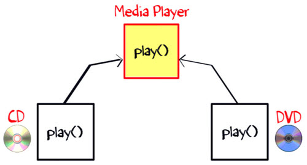
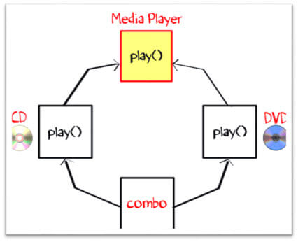
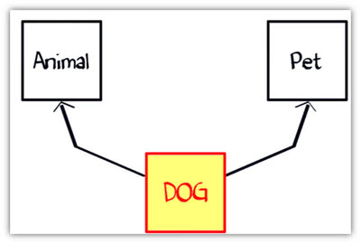
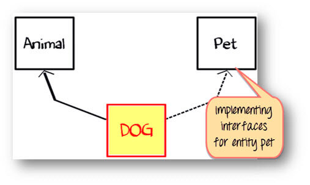

Interface trong Java
---

# Interface là gì ?
Một interface giống như một class java, nhưng nó chỉ có các static constants và abstract method. Java sử dụng Interface để triển khai tính kế thừa. Một class java có thể triển khai nhiều java interface. Tất cả các method trong một interface là public và abstract.

## Cú pháp để khai báo Interface
```java
interface {
	//methods
}
```

Để sử dung một interface trong class của bạn, thêm từ khóa "implements" sau tên class của bạn, phía sau đó là tên interface.

## Ví dụ về triển khai Interface

```java
class Dog implements Pet
```

```java
interface RidableAnimal extends Animal, Vehicle
```

# Ví sao một interface là bắt buộc ?
Để hiểu khái niệm của Java interface là quan trnjg, hãy xem một ví dụ. Một class "Media Player" có 2 class con: CD player và DVD player. Mỗi class có các triển khai riêng để chơi nhạc.



Một class khác "Combo drive" kế thừa cả 2 CD và DVD. Method nào sẽ được kế thừa ? Đây có thể là một vấn đề thiết kế nghiêm trọng. Và tóm lại, Java không cho phép đa kế thừa.



Bây giờ, xem một ví dụ khác là Dog.

Giả sử, bạn có một yêu cầu là class "Dog" kế thừa class "animal" và "Pet" Nhưng bạn không thể kế thừa 2 class trong Java. Vậy bạn phải làm gì ? Giải pháp là Interface.



Quy tắc của Interface là:
- Một interface là 100% abstract class và chỉ co abstract method.
- Class có thể triển khai bao nhiêu Interface cũng được

Class Dog có thể mở rộng clsas Animal và triển khi interface Pet




# Ví dụ về Java Interface
**Step 1**: Copy đoạn mã sau vào editor:

```java
interface Pet{
  public void test();
}
class Dog implements Pet{
   public void test(){
     System.out.println("Interface Method Implemented");
  }
   public static void main(String args[]){
     Pet p = new Dog();
     p.test();
  }
}
```

**Step 2**: Lưu lại, biên dịch và chạy. Quan sát kết quả.

# Khác nhau giữa Class và Interface
| Class        | Interface         | 
|:-------------|:------------------|
| Trong class, bạn có thể khởi tạo biến và tạo object| Trong Interface, bạn không thể khởi tạo biến và tạo object |
| Class có thể chứa phần triển khai của method | Interface không chứa phần triển khai của method |
| Modifier của Class là Public, Protected và Private | Interface chỉ có mỗi Public |

# Khi nào thì sử dụng Interface và Abstract class
- Sử dụng một abstract class khi một template cần được định nghĩa chung cho một nhóm class
- Sử dụng Interface khi quyền hạn cần được định nghĩa ở class khác, bất kể là cây kế thừa của class đó.

# Những sự thật về Interface
- Một class có thể implements nhiều interface. Nó bắt buộc phải implements tất cả các method được định nghĩa trong các interface
- Class nên override tất cả các abstract method được khai báo trong Interface
- Interface cho phép gửi đi một message đến một object mà không cần đến phần thân của class đó kèm theo
- Class cần cung cấp tất cả chức năng cho các method được định nghĩa trong Interface
- Tất cả các method trong interface đều là public và abstract
- Một interface không thể được khởi tạo
- Một interface không thể implements một interface khác. Nó có thể kế thừa interface khác nếu cần.
- Một interface có thể được khai báo bên trong một interface khác, nó gọi là interface lồng nhau
- Trong thời gian khởi tạo, biến interface cần dược khởi tạo. Trường hợp khác, trình biên dịch sẽ báo lỗi.
- Class không thể implements 2 interface mà có tên giống nhau nhưng khác kiểu trả về.

# Tổng kết
- Class cần cung cấp tất cả chức năng cho các method được định nghĩa trong Interface
- Tất cả các method trong interface đều là public và abstract
- Một interface không thể được khởi tạo
- Một tham chiếu của interface có thể trỏ đến một đối tượng mà class của nó implements interface đó.
- Một interface có thể mở rộng một hoặc nhiều interface khác. Một class có thể mở rộng chỉ một class nhưng có thể kế thừa nhiều interface

[Back](./)
