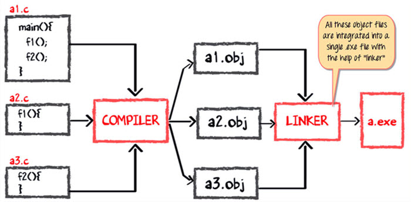

Giới thiệu về kiến trúc của JVM - Java Virtual Machine
---

Trong mục này chúng ta sẽ tìm hiểu:
1. JVM là gì 
2. Kiến trúc JVM
3. Quá trình biên dịch và thực thi mã Java
4. 

# JVM là gì?
JVM là một máy ảo cung cấp môi trường để chạy các chương trình được viết bằng ngôn ngữ Java. JVM sẽ chuyển đổi mã code được biên dịch từ mã Java thành mã máy và thực thi chúng. JVM là một phần của JRE - Java Runtime Environment. Nó được gọi là Máy ảo Java - Java Virtual Machine.

Đối với các ngôn ngữ khác, trình biên dịch sẽ thực hiện biên dịch mã code thành mã máy cho từng hệ thống cụ thể. Tuy nhiên, trình biên dịch Java thực hiện biên dịch mã Java thành mã chỉ dành cho JVM và chỉ được hiểu bởi JVM.
Đầu tiên, Java code sẽ được biên dịch thành mã bytecode, mã bytecode này sẽ được JVM biên dịch thành mã máy tương ứng với từng hệ điều hành cụ thể. Giữa máy tính và source code Java, mã bytecode Java là trung gian. JVM chịu trách nhiệm phân bổ nó vào bộ nhớ máy tính để thực thi.

# Kiến trúc JVM

## 1. ClassLoader
Class Loader là một hệ thống con được sử dụng để tải các file .class - được biên dịch từ file .java. Nó thực hiện 3 nhiệm vụ chính: Tải file class(Loading), Liên kết(Linking) và Khởi tạo(Initialization)

## 2. Method Area
Là nơi chứa cấu trúc của Class, giống như metadata, cấu trúc này không thay đổi trong quá trình chạy, và nó chứa các mã của các method - phương thức.

## 3. Heap
Tất cả các Object, các biến liên quan và các mảng được chứa trong vùng Heap. Vùng nhớ này được chia sẻ đồng thời cho nhiều threads.

## 4. JVM language Stacks
Java language Stacks chứa các biến local, và một phần kết quả của chúng. Mỗi thread sẽ có JVM stack riêng biệt, được tạo đồng thời lúc thread được tạo. Một vùng mới được tạo bất cứ khi nào một method được gọi và nó sẽ được xóa đi khi quá trình gọi method đó được hoàn thành.

## 5. PC Registers
PC Registers lưu địa chỉ của JVM đang thực thi. Trong Java, mỗi thread đều có PC Registers của riêng nó.

## 6. Native Method Stacks
Native Method Stacks lưu các hướng dẫn đến các thư viện liên kết, các thư viện này được viết bằng ngôn ngữ khác ngoài Java.

## 7. Execution Engine
Nó là một kiểu phần mềm được dùng để thực thi mã bytecode Java

## 8. Native Method interface
Native Method interface là một khung chương trình. Nó cho phép mã Java đang chạy trong JVM gọi bởi các thư viện và ứng dụng gốc.

## 9. Native Method Libraries
Native Method Libraries là một tập hợp các Thư viện riêng (C, C ++) cần thiết cho Công cụ thực thi.

# Quy trình soạn thảo và thực thi mã phần mềm
Thứ tự để soạn thảo và thực thi một phần mềm được định nghĩa như sau:
1. Editor - Trình soạn thảo: Là nơi mà bạn nhập vào mã code chương trình của bạn, ví dụ như notepad là được dùng phổ biến.
2. Compliler - Trình biên dịch: Chuyển đổi mã code chương trình bạn đã viết thành mã ngôn ngữ cấp cao, có thể hiểu được bởi máy tính.
3. Linker - Trình liên kết: Dùng để phối hợp các file tham khảo khác nhau vào trong chương trình chính của bạn để chúng làm việc cùng nhau.
4. Loader - Trình tải mã code: Là nơi mà tải mã code đã được biên dịch vào nơi có thể thực thi ví dụ như Ổ cứng, RAM. Việc này được thực hiện tự động khi thực thi chương trình.
5. Execution - Trình thực thi: Trình thực thi mã code được xử lý bởi hệ điều hành & bộ xử lý của bạn. Nơi mà nó có thể thực hiện tác vụ mà bạn muốn.

# C code được biên dịch và thực thi như thế nào
Để hiểu quá trình biên dịch và thực thi của Java như thế nào, đầu tiên ta xem xét quá trình thực hiện biên dịch, liên kết và thực thi của C - Ngôn ngữ lập trình tạo ra nhiều phần mềm phổ biến .EXE

Giả định có 3 file C như sau:
1. Method main dùng để khởi chạy đặt trong file a1.c
2. Method  f1 được đặt trong file a2.c
3. Method  f2 được đặt trong file a3.c

Trình biên dịch C sẽ biên dịch 3 file .c thành mã máy tương ứng với 3 file .obj.

Bước tiếp theo tích hợp các file .obj vào một file .exe với sự hỗ trợ của trình liên kết. Trình liên kết sẽ tập hợp các file .obj lại với nhau và tạo ra file .exe.

Đến khi chương trình thực thi, trình tải chương trình sẽ tải file .exe vào RAM và thực thi chúng.

# Java code được biên dịch và thực thi như thế nào
Giả định có 3 file Java như sau:
1. Method main dùng để khởi chạy đặt trong file a1.java
2. Method  f1 được đặt trong file a2.java
3. Method  f2 được đặt trong file a3.java

Trình biên dịch Java sẽ biên dịch 3 file .java thành 3 file .class tương ứng, trong file .class chứa bytecode được hiểu bởi JVM. Không có sự liên kết gì ở đây. Các file được biên dịch độc lập.

JVM hiện diện ở RAM, trong quá trình thực thi nó sẽ dùng Class Loader để bố trí các file .class vào RAM. 

Tiếp theo, bytecode trong file .class sẽ được biên dịch thành mã máy tương ứng để thực thi. Quá trình này gọi là Just-in-time compiler (JIT), đây là lý do tại sao Java tương đối chậm.

NOTE: JIT or Just-in-time compiler là một phần của JVM, nó biên dịch bytecode của chức năng tương ứng cùng lúc thực thi.

# Vì sao Java vừa là ngôn ngữ biên dịch vừa là ngôn ngữ thông dịch
Ngôn ngữ lập trình được chia thành các loại như sau:
1. Ngôn ngữ bậc cao, ví dụ như Java, C++
2. Ngôn ngữ bậc trung, ví dụ như C
3. Ngôn ngữ bậc thấp, ví dụ như Assembly
4. Cuối cùng là ngôn ngữ bậc thấp nhất, ngôn ngữ máy

Một trình biên dịch là một chương trình thực hiện chuyển đổi một chương trình từ ngôn ngữ bậc này sang bậc khác. Ví dụ như chuyển đổi chương trình ngôn ngữ C++ thành ngôn ngữ máy.

Với Java thì chuyển đổi chương trình từ ngôn ngữ bậc cao thành bytecode (Cũng là một loại mã máy) được hiểu bởi JVM

Trình thông dịch là chương trình thực hiện chuyển đổi chương trình từ ngôn ngữ lập trình cấp bậc này thành ngôn ngữ lập trình khác cùng cấp độ. Ví dụ như chuyển đổi chương trình Java sang C++

Trong Java, JIT chuyển đổi mã bytecode thành ngôn ngữ máy cùng cấp độ mà có thể hiểu được bởi máy tính.

Tóm lại, Java là ngôn ngữ lập trình vừa biên dịch vừa thông dịch.

# Vậy tại sao Java lại chậm
Có 2 nguyên nhân khiến Java chậm:
1. Dynamic Linking: Không giống như C, liên kết được thực hiện trong lúc chạy chương trình Java.
2. Thông dịch Run-time: Chuyển đổi bytecode thành ngôn ngữ máy tương ứng thực hiện trong lúc chạy chương trình, nó khiến cho Java giảm tốc độ thực thi.

Tuy nhiên, phiên bản mới nhất của Java đã cải thiện được tốc độ thực thi chương trình ở mức độ lớn.

# Tổng kết
- JVM là một máy ảo chứa bytecode Java, nó thực hiện chuyển đổi bytecode thành mã mãy tương ứng để thực thi.
- Trong JVM, mã Java được biên dịch thành bytecode, bytecode này sẽ được thông dịch thành ngôn ngữ máy trên nhiều máy khác nhau
- JIT là một phần của JVM, nó được sử dụng để tăng tốc thời gian thực thi chương trình.
- So sánh với các các trình biên dịch mã máy khác, Java có thể thực thi chậm hơn.

[Back](./)
