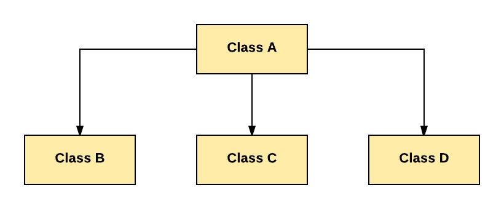

Kế thừa trong Java OOPs
---

# Kế thừa là gì ?
Kế thừa là cơ chế mà một class có thể sử dụng những thuộc tính của class khác. Ví dụ: Con cái kế thừa đặc điểm của cha mẹ. Với kế thừa bạn có thể sử dụng lại những thuộc tính, method của class đã có. Vì thế, **kế thừa** tạo điều kiện để **tái sử dụng** và là một khái niệm quan trọng trong OOPs.

# Các kiểu của Kế thừa:
Đây là các kiểu khác nhau của kế thừa trong Java

## 1. Single Inheritance
Kế thừa đơn là một class mở rộng một class khác (chỉ một classs)


Trong sơ đồ trên, Class B chỉ mở rộng Class A. Class A là supper class và Class B là Sub-class.

## 2. Multiple Inheritance
Trong đa thừa kế, một class mở rộng nhiều hơn một class. Java không hỗ trợ đa thừa kế.


Trong hình trên, Class C kế thừa cả 2 class A và B

## 3. Multilevel Inheritance
Trong kế thừa đa cấp, một class có thể kế thừa từ một gốc class. Vì thế, class gốc trở thành class cơ sở cho class mới.


Như hình trên, Class C lfa Sub-class của B, và Class B là Sub-class của A

## 4. Hierachical Inheritance
Trong kế thừa thứ bậc, một class được kế thừa bởi nhiều class khác.



Như ví dụ trên, Class B, C, D kế thừa class A

## 5. Hybird Inheritance

Kế thừa hỗn hợp là sự kết hợp của Kế thừa đơn và đa thừa kế


Như hình trên, tất cả thành phần **public** và **protected** của class A đều được kế thừa trong class D, đầu tiên thông qua class B và thứ hai thông qua class C

# Kế thừa trong Java
- Trong Java, khi một quan hệ **Is-A** tồn tại giữa hai class thì chúng ta sử dụng kế thừa
- Class cha được gọi là super class và class kế thừa gọi là sub class.
- Từ khóa **extends** được sử dụng ở class con để kế thừa các tính năng ở class cha.
- Kế thừa là quan trọng vì nó cho phép sử dụng lại code.

## Cú pháp kế thừa trong Java
```java
class subClass extends superClass  
{  
   //methods and fields  
}  
```

# Ví dụ về kế thừa trong Java


```java
class Doctor {
 void Doctor_Details() {
  System.out.println("Doctor Details...");
 }
}

class Surgeon extends Doctor {
 void Surgeon_Details() {
  System.out.println("Surgen Detail...");
 }
}

public class Hospital {
 public static void main(String args[]) {
  Surgeon s = new Surgeon();
  s.Doctor_Details();
  s.Surgeon_Details();
 }
}
```

# Từ khóa Super
Từ khóa **super** là giống với từ khóa **this**

Từ khóa **super** có thể được dùng để truy cập bất cứ thành phần biến hoặc method nào ở class cha.

Từ khóa **super** có thể được dùng ở cấp độ biến, method, contructor

## Cú pháp:
```java
super.<method-name>();
```

# Ví dụ về Kế thừa trong Java OOPs
Xem xét về một ứng dụng ngân hàng [Link](./khai-niem-OOP-trong-java.md)

Chúng ta giả sử có 2 kiểu account khác nhau, một dùng để gửi tiền và một dùng để kiểm tra.


Hãy so sánh và tìm hiểu làm thế nào để chúng ta có thể tiếp cận từ quan điểm lập trình hướng đối tượng và lập trình cấu trúc.
**Với cách tiếp cận hướng cấu trúc**: Trong lập trình cấu trúc, chúng ta sẽ có 2 chức năng
1. Một để rút tiền
2. Hoạt động gửi tiền

Và hoạt động này là giống nhau trên các tài khoản


 
**Cách tiếp cận OOPs**: Khi sử dụng lập trình hướng đối tượng, chúng ta sẽ tạo 2 class.
- Mỗi class đều có phần triển khai **nộp tiền** và **gửi tiền**
- Điều này thấy như là dư thừa


## Thay đổi yêu cầu trong phần mềm
Bây giờ, có sự thay đổi yêu cầu đặc tính kỹ thuật cho một vài thứ, đó là phổ biến trong ngành phần mềm. Bạn được giả định thêm chức năng đặc quyền vào Banking Account với tài khoản thấu chi. Về nền tảng thì thấu chi là một đặc quyền khi bạn có thể rút một số tiền nhiều hơn số tiền có sẵn trong số dư tài khoản của bạn.


**Tiếp cận hướng cấu trúc**: Sử dụng các tiếp cận cấu trúc, tôi phải chỉnh sửa chức năng rút tiền, nó đã sẵn sàng kiểm thử và đóng gói. Và thêm một chức năng giống bên dưới sẽ phải kiểm tra lại mọi thứ.


**Tiếp cận hướng đối tượng**: Sử dụng hướng đối tượng, bạn chỉ cần viết một class mới với phần triển khai duy nhất cho chức nwang **rút tiền**, chúng ta sẽ không đụng đến những phần đã kiểm tra của code.


## Thay đổi yêu cầu khác
Điều gì sẽ xảy ra nếu thêm thay đổi yêu cầu nữa ? Giống như thêm thẻ tín dụng với yêu cầu riêng về tiền gửi.


**Tiếp cận hướng cấu trúc**: Sử dụng hướng tiếp cận cấu trúc, bạn phải thay đổi những phần đã kiểm thử của source code một lần nữa.


**Tiếp cận hướng đối tượng**: Nhưng sử dụng hướng đối tượng, bạn sẽ chỉ cần tạo một class mới với phần triển khai riêng biệt cho chức năng **nộp tiền** (Được đánh dấu khung đỏ như bên dưới)

Vì vậy, mặc dù lập trình hướng cấu trúc có vẻ dễ dàng lúc bắt đầu, nhưng càng về sau thì lập trình hướng đối tượng có nhiều ưu điểm hơn.


# Ưu điểm của Kế thừa trong lập trình hướng đối tượng OOPs
Người ta có thể lập luận rằng, có những đoạn mã lặp đi lặp lại trên các class.

Để khắc phục điều đó, bạn tạo một class cha, gọi là **account** và triển khai các chức năng chung **nộp tiền** và **rút tiền**. Và tạo ra các class con kế thừa class **accout**. Vì vậy, chúng sẽ có quyền truy cập vào chức năng **nộp tiền** hay **rút tiền** ở class **account**

Các chức năng không bắt buộc phải triển khai tại các class con. **Đó là kế thừa trong Java.**


[Back](./)
