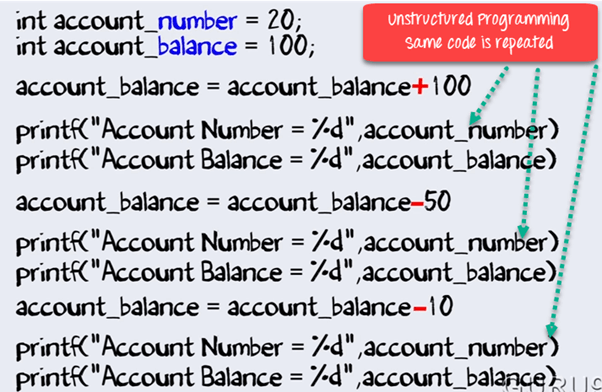
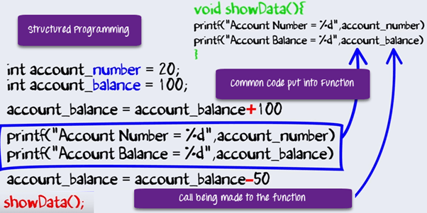
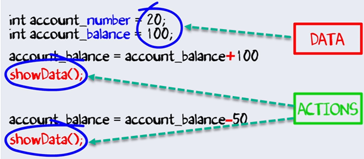

Khái niệm OOP trong Java
---

# OOP là gì?
Object Oriented Programming là một khái niệm lập trình mà nó làm việc dựa trên nguyên tắc là các đối tượng là một phần quan trọng nhất của chương trình. Nó cho phép người dùng tạo những đối tượng mà họ muốn và cũng tạo ra phương thức để xử lý các đối tượng đó. Thao tác những đối tượng để lấy kết quả là mục tiêu của Object Oriented Programming.

Object Oriented Programming được biết phổ biến với tên OOP, nó được sử dụng trong các ngôn ngữ lập trình hiện đại như Java. 

# Những khái niệm cơ bản trong OOP
## 1. Class
Class là một nhóm các thực thể giống nhau, nó chỉ là thành phần logic, không phải là thành phần vật lý. Ví dụ, nếu bạn có một class được gọi là “Expensive Cars”, nó có thể có những đối tượng như Mercedes, BMW, Toyota, etc. Những thuộc tính(data) của nó có thể là giá xe(price) hoặc tốc độ(speed) của những chiêc xe. Trong khi những phương thức có thể thực hiện với những chiếc xe như là lái xe(driving), lùi xe(reverse), đỗ xe(braking), ...

## 2. Objects
Một đối tượng có thể được định nghĩa như một bản sao của một class, và có thể có nhiều bản sao của một class trong một chương trình. Một đối tượng chứa data và các chức năng, nó hoạt động dựa trên data. Ví dụ như cái bàn, xe đạp, cây bút, ...

## 3. Kế thừa
Kế thừa là một khái niện của OOP, trong đó một đối tượng có được các thuộc tính và hành vi của đối tượng cha. Nó tạo nên quan hệ cha-con giữa hai class. Nó cung cấp cơ chế mạnh mẽ và tự nhiên để cấu trúc và tổ chức cho bất cứ phần mềm nào.

## 4. Polymorphism
Đa hình đề cập đến khả năng của một biến, đối tượng hoặc chức năng để đảm nhận nhiều hình thức. Ví dụ, trong Tiếng Anh, động từ chạy có một nghĩa khác nếu bạn dùng nó với một chiếc laptop, một cuộc đua, và một việc kinh doanh nào đó. Ở đây, chúng ta hiểu nghĩa của chạy dựa trên một từ khác được sử dụng cùng với nó. Điều tương tự cũng giống như Đa hình.

## 5. Abstraction
Trừu tượng là một hành động thể hiện các tính năng thiết yếu mà không chứa các chi tiết bên trong. Nó là một kỹ thuật tạo một kiểu dữ kiệu mới phù hợp với úng dụng cụ thể. Ví dụ, trong khi lái xe, bạn không cần lo lắng về công việc nội bộ bên trong nó. Ở đây, bạn chỉ cần lo lắng cho cho các thành phần như chân ga, vô lăng, ...

## 6. Encapsulation
Đóng gói là một kỹ thuật OOP dùng để đóng gói dữ liệu và mã code. Trong khái niệm OOP này, các biến của một class luôn ẩn với các class khác. Nó chỉ có thể được truy cập bằng phương thức của chính class đó. Ví dụ, trong trường học, một học sinh không thể tồn tại ngoài một lớp học được.

## 7. Association
Sự liên kết là một quan hệ giữa hai đối tượng. Nó định nghĩa sự đa dạng của các đối tượng. Trong khái niệm OOP này, tất cả đối tượng có vòng đời riêng của nó và không có owner. Ví dụ, nhiều học sinh có thể liên kết với một giáo viên, trong khi một học sinh cũng có thể liên kết với nhiều giáo viên.

## 8. Aggregation - Tập hợp
Trong kỹ thuật này, tất cả đối tượng có vòng đời riêng của nó. Tuy nhiên, quyền sở hữu sao cho đối tượng con không thể thuộc về đối tượng cha khác. Ví dụ xem xét class/objects của bộ phận và giáo viên. Ở đây, một giáo viên có thể phụ thuộc nhiều bộ phận, nhưng ngay cả khi chúng ta xóa đi bộ phận thì đối tượng giáo viên cũng không bao giờ bị xóa.

## 9. Composition - Thành phần
Thành phần là một trạng thái khác của Tập hợp. Nó cũng có thể gọi là quan hệ chết. Đối tượng con không có vòng đời riêng của nó, nên khi đối tượng cha bị xóa thì tất cả các đối tượng con cũng tự động bị xóa đi. Ví dụ là mối quan hệ giữa nhà và những căn phòng. Bất cứ căn nhà nào cũng có một số phòng. Một phòng không thể là một phần của 2 căn nhà khác nhau. Vì vậy, nếu bạn xóa nhà thì phòng cũng sẽ bị xóa.

# Các ưu điểm của OOP
- OOP cung cấp một cấu trúc mô-đun rõ ràng và dễ hiểu cho chương trình.
- Các đối tượng được tạo bởi OOP có thể được sử dụng lại trong các chương trình khác, như vậy nó giúp tiết kiệm chi phí phát triển đáng kể.
- Những chương trình lớn là rất khó để viết, nhưng nếu được phát triển và kiểm thử theo khái niệm OOP thì họ có thể thiết kế tốt hơn với ít sai xót.
- Nó tăng cường tính mô-đun của chương trình vì mọi đối đượng đều tồn tại độc lập.

# So sánh OOP với các kiểu lập trình khác với sự giúp đỡ của các ví dụ
Ngôn ngữ lập trình có thể phân loại vào 3 kiểu sau:
1. **Ngôn ngữ lập trình không cấu trúc**: Là kiểu lập trình nguyên thủy nhất của ngôn ngữ lập trình điều khiển tuần tự. Mã code lặp đi lặp lại nhiều lần trong suốt chương trình.
2. **Ngôn ngữ lập trình có cấu trúc**: Không dùng kiểu lập trình điều khiển tuần tự. Dùng function để cho phép sử dụng lại mã code.
3. **Ngôn ngữ lập trình hướng đối tượng**: Kếp hợp Dữ liệu và hành động cùng nhau.

Chúng ta sẽ hiểu 3 kiểu lập trình trên với một ví dụ dưới đây.
Giả sử bạn muốn tạo một phần mềm ngân hàng với các chức năng dưới đây
- Nạp tiền
- Rút tiền
- Kiểm tra số dư

## Ngôn ngữ lập trình không cấu trúc


Cùng là một hoạt động Nạp tiền, rút tiền hay kiểm tra số dư nào, nhưng nếu nó được thực hiện nhiều lần thì bạn đều phải sử dụng đoạn code đó lặp lại rất nhiều lần.

## Ngôn ngữ lập trình có cấu trúc


Với lập trình có cấu trúc, bạn tổ chức các đoạn mã lặp đi lặp lại nhiều lần vào các function - ở đây là đoạn mã thể hiện cho hoạt động Kiểm tra số dư. Bạn chỉ cần gọi nó khi nào cần thực hiện hoạt động Kiểm tra số dư thay vì phải viết lại đoạn mã như ở **Ngôn ngữ lập trình không cấu trúc**

## Ngôn ngữ lập trình hướng đối tượng


Trong chương trình của chúng ta, chúng ta xử lý dữ liệu và thực hiện những hành động đặc biệt trên dữ liệu đó. Thực tế, có dữ liệu và thực hiện hành động trên dữ liệu đó là đặc trưng rất cơ bản trong bất cứ phần mềm nào. Các chuyên gia về Chương trình phần mềm đã nghĩ đến việc kế hợp dữ liệu và hoạt động. Vì thế, OOP ra đời.

Dưới đây là đoạn code ví dụ trong OOP, chúng có một số dữ liệu(Số tài khoản, số dư) và thực hiện hoạt động(Hiển thị số dư) trên dữ liệu đó.
```java
  Class Account{
    int account_number;
    int account_balance;
  public void showdata(){
    system.out.println(“Account Number”+account_number)
    system.outprintln(“Account Balance”+ account_balance)
  }
}
```

Kết hợp dữ liệu và hành động, chúng ra sẽ có nhiều lợi thế so với **Ngôn ngữ lập trình có cấu trúc**
- Abtraction
- Encapsulation
- Inheritance
- Polymorphism

Chúng ta sẽ cùng nhau thảo luận các vấn đề trên ở các hướng dẫn tiếp theo.

[Back](./)
