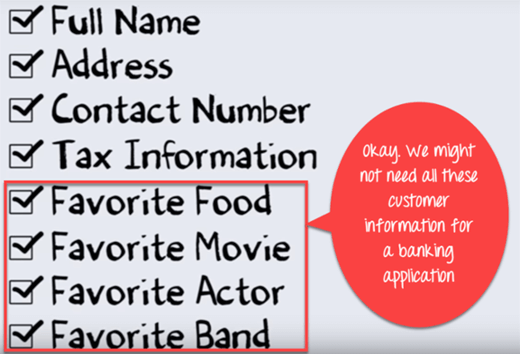
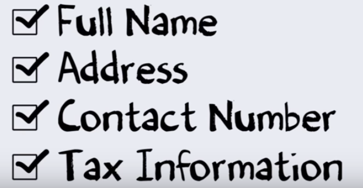

Trừu tượng hóa trong Java là gì ? Học với ví dụ Java
---

# Trừu tượng hóa trong Java là gì ? 
Trừu tượng hóa là chọn dữ liệu từ một nhóm đối tượng lớn hơn để chỉ hiển thị các chi tiết có liên quan đến đối tượng. Nó giúp giảm sự phức tạp của chương trình và chi phí. Trong Java, trừu tượng hóa được thực hiện bằng cách dùng Abstract class và Interface. Nó là một trong những khái niệm quan trọng của OOP.

# Học khái niệm Trừu tượng hóa với ví dụ Java
Giả sử bạn muốn tạo một ứng dụng ngân hàng và bạn được yêu cầu để tập hợp tất cả thông tin về khách hàng của bạn. Có nhiều khả năng bạn sẽ đưa ra các thông tin bên dưới đây về khách hàng của mình.

Nhưng không phải tất cả thông tin trên đều cần thiết để tạo một ứng dụng ngân hàng

Vậy, bạn cần phải chọn chỉ những thông tin hữu ích cho ứng dụng ngân hàng của bạn từ một nhóm. Dữ liệu như tên, địa chỉ, thông tin thuế, là có ý nghĩa cho một ứng dụng ngân hàng.

Kể từ đây, chúng ta có thể lấy/xóa/chọn thông tin khách hàng từ một nhóm lớn hơn, quá trình này được gọi là Trừ tượng hóa.

Tuy nhiên, những thông tin tương tự một khi đã được trích xuất có thể được sử dụng trong một loạt các ứng dụng. Ví dụ, bạn có thể sử dụng data tương tự cho ứng dụng bệnh viện, ứng dụng việc làm, ứng dụng chính phủ, ... với rất ít hoặc là không có sự thay đổi. Ví thế, nó trở thành Dữ liệu chính của bạn. Đó là ưu điểm của Trừ tượng hóa.

# Làm sao thực thi Trừu tượng hóa ?
Ở cấp độ cao, Trừu tượng hóa là một quá trình của ẩn đi các thực hiện chi tiết và chỉ hiển thị cho người dùng về các chức năng cơ bản. Nó chỉ chỉ ra những thứ quan trọng với người dùng và ẩn đi những chi tiết bên trong. Ví dụ trong khi gửi SMS, bạn chỉ cần viết tin nhắn và gửi đi. Ở đây, bạn không quan tâm về xử lý bên nội bộ của việc gửi tin nhắn. Trừu tượng hóa có thể được thực hiện bằng cách dùng Abstract Class và Abstract Method trong Java.

## Abstract Class
Một class mà được khai báo "abstract" được gọi là một abstract class. Nó có thể chứa những abstract method cũng như những method cụ thể. Một class bình thường thì không thể có những abstract class.

## Abstract Method
Một method mà không có phần xử lý chi tiết được gọi là một Abstract Method. Nó cũng cần khai báo "abstract" như abstract class. Một abstract method thì không bao giờ được khai báo final vì abstract class cần được thực hiện xử lý chi tiết cho tất cả các abstract method.

# Nguyên tắc của Abstract Method
- Abstract method không có một xử lý chi tiết, nó chỉ có tên method.
- Nếu một class sử dụng một abstract method thì chúng cần khai báo là "abstract". Tuy nhiên điều ngược lại thì không đúng. Nghĩa là một class không nhất thiết phải có một abstract method.
- Nếu một class thông thường được mở rộng từ một abstract class thì class đó cần phải triền khai tất cả các abstract method ở abstract class cha.

# Khác nhau giữa Trừu tượng hóa và Đóng gói
| **Trừu tượng hóa**| **Đóng gói** |
|:-------------|:------------------|
| Abstraction xử lý vấn đề ở mức thiết kế.| Đóng gói xử lý vấn đề ở mức triển khai.|
| Abstraction là về ẩn những chi tiết không mong muốn và hiển thị những thông tin cần thiết nhất.| Đóng gói nghĩa là ẩn code và dữ liệu vào trong một đơn vị.|
| Abstraction cho phép tập trung vào những gì mà đối tượng cần phải có nhất.| Đóng gói nghĩa là ẩn những chi tiết bên trong và xử lý logic làm thế nào mà một đối tượng có thể làm gì đó vì lý do bảo mật|

# Khác nhau giữa Trừu tượng hóa và Interface
| **Trừu tượng hóa**| **Interface** |
|:-------------|:------------------|
| Một abstract class có thể cả abstract method hoặc method thông thường | Interface thì chỉ có abstract method|
| Abstraction không hỗ trợ nhiều kế thừa | Interface hỗ trợ nhiều kế thừa|
| Abstraction có thể nhận xử lý chi tiết của Interface| Interface không thể nhận xử lý chi tiết của abstract class|
| Abstraction có thể có một protected và abstract public method| Interface chỉ có thể có public abstract method|
| Abstraction có thể có final, static hoặc final static biến với bất cứ khả năng truy cập nào| Interface chỉ có thể có public static final biến|

# Ưu điểm của Trừu tượng hóa
- Lợi ích chính của một abstract class là nó cho phép bạn nhóm một số class liên quan như anh em
- Trừu tượng hóa giúp giảm độ phức tạp của thiết kế và quy trình triển khai trong phần mềm

# Khi nào sử dụng Abstract Method và Abstract class ?
- Abstract method hầu hết được khai báo trong đó 2 hoặc nhiều class con cũng làm điều tương tự theo cách khác nhau thông qua việc triển khai chi tiết. Nó cũng kế thừa cùng Abstract class và cung cấp các triển khai khác nhau của abstract method.
- Abstract class giúp mô tả những kiểu hành vi chung và hệ thống cấp bậc class hướng đối tượng. Nó cũng mô tả class con để cung cấp triển khai chi tiết cho abstract class.

# Tổng kết:
- Trừu tượng hóa là quá trình tập hợp các bộ dữ liệu quan trọng cho Object trong phần mềm của bạn và bỏ qua những dữ liệu không quan trọng.
- Một khi bạn đã có một mô hình đối tượng của bạn dùng Abstraction, cùng một bộ dữ liệu có thể được dùng ở những ứng dụng khác nhau.
- Trong Java, abstraction được thực hiện bằng cách dùng Abstract class và Interface. Chúng ta sẽ học chi tiết về Abstract class và Interface trong Tutorial khác.

[Back](./)
