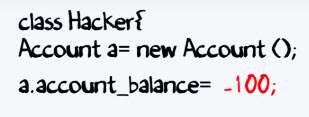
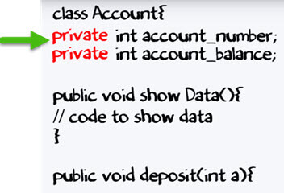
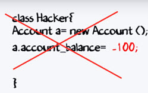
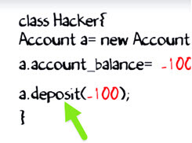
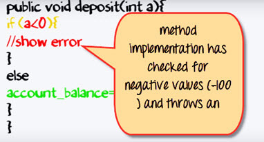
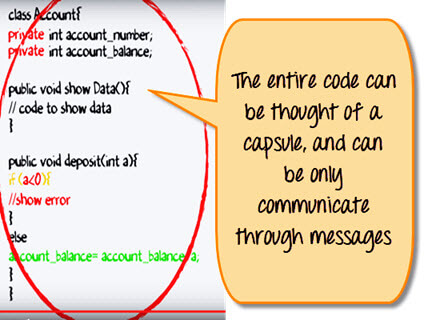

Đóng gói trong Java OOP với ví dụ
---

# Đóng gói trong Java là gì?
Đóng gói là một nguyên tắc của đóng gói dữ liệu(biến) và code cùng nhau dưới dạng một đơn vị. Nó là một trong bốn khái niệm của OOP. 3 cái còn lại là Kế thừa, Đa hình và Trừu tượng

# Học Đóng gói với một ví dụ
Để hiểu chi tiết Đóng gói là gì, xem xét class tài khoản ngân hàng bên dưới với các phương thức nạp tiền và hiên thị số dư 
```java 
class Account {
    private int account_number;
    private int account_balance;

    public void show Data() {
        //code to show data 
    }

    public void deposit(int a) {
        if (a < 0) {
            //show error 
        } else
            account_balance = account_balance + a;
    }
}
```

Giả sử, một hacker đã có quyền để truy cập đến mã của tài khoản ngân hàng của bạn. Bây giờ, hacker ấy muốn nạp số tiền là -100 đô la vào trong tài khoản của bạn bằng 2 cách. Hãy xem phương pháp và cách tiếp cận của hacker.

**Cách tiếp cận đầu tiên**: Hacker cố gắng để nạp một số tiền không hợp lệ(giả sử là -100) vào tài khoản của bạn bằng cách thao túng mã.



Bây giờ, câu hỏi là "Nó có khả thi?". Hãy nghiên cứu.

Thực tế, một biến trong một class đã được thiết lập là "private" như hiển thị bên dưới. Nó chỉ có thể được truy cập với phương thức được định nghĩa bên trong class. Không class hay object nào khác có thể truy cập nó.



Nếu một dữ liệu thành viên là private, nó có nghĩa nó chỉ có thể được truy cập bên trong cùng class. Không một class nào bên ngoài có thể truy cập dữ liệu hoặc biến private của một class khác.

Vậy, trong trường hợp của chúng ta, hacker không thể nạp tiền -100 vào tài khoản của bạn.



**Cách tiếp cận thứ hai**: Cách tiếp cận đầu tiên của Hacker đã không thành công để nạp tiền vào tài khoản. Tiếp theo, anh ta cố gắng để thực hiện nạp một số tiền -100 bằng cách sử dụng phương thức "deposit"



Nhưng phương thức đã có một kiểm tra cho giá trị âm. Vì vậy, lần tiếp cận thứ hai này cũng không thành công.



Do đó, bạn không bao giờ để lộ dữ liệu của bạn ra bên ngoài. Điều này làm cho ứng dụng của bạn an toàn.



Toàn bộ mã được đóng gói như một viên nang. Và bạn chỉ có thể giao tiếp thông qua các message truyền đi. Do đó đóng gói tên.

# Ẩn dữ liệu trong Java
Thông thường, Đóng gói trong Java được giới thiệu như là ẩn dữ liệu. Nhưng nhiều hơn ẩn data, khái niệm đóng gói có ý nghĩa là để quản lý tốt hơn hoặc nhóm các dữ liệu liên quan.
Để đạt được mức độ đóng gói ít hơn trong Java, bạn có thể dùng modifier như "protected" hoặc "public". Với đóng gói, người phát triển có thể thay đổi một phần của code dễ dàng mà không ảnh hưởng đến phần khác.

# Phương thức Getter và Setter trong Java
Nếu một dữ liệu được khai báo là "private" thì nó chỉ có thể được truy cập trong cùng một class. Không class bên ngoài nào có thể truy cập dữ liệu của class đó. Nếu bạn cần truy cập biến đó, bạn phải sử dụng phương thức public "getter" và "setter".

Getter và Setter method được dùng để tạo, chỉnh sửa, xóa và xem giá trị của biến.

Đoạn code bên dưới là một ví cụ của getter và setter method
```java
class Account{ 
	private int account_number;
	private int account_balance; 
    // getter method
	public int getBalance() {
        return this.account_balance;
    }
    // setter method
	public void setNumber(int num) {
        this.account_number = num;
    }
}
```

Trong ví dụ trên, getBalance() là getter method để đọc giá trị của biến account_balance và setNumber() là setter message để thiết lập và chỉnh sửa giá trị cho biến  account_number.

# Sự trừu tượng với đóng gói
Thông thường, đóng gói rất dễ bị hiểu nhầm với sự trừu tượng. Hãy phân biệt chúng:
- Đóng gói là về "Làm thế nào" để đạt được một chức năng
- Sự trừu tượng là về "Cái gì" một class có thể làm được

Một ví dụ đơn giản để hiểu sự khác nhau này là một chiêc điện thoại di động. Trong đó, sự phức tạp của bo mạch được đóng gói trong một màn hình cảm ứng. Và giao diện được cung cấp để trừu tượng hóa nó ra.

# Ưu điểm của Đóng gói trong Java
- Đóng gói là ràng buộc dữ liệu và chức năng liên quan đến nó. Chức năng ở đây nghĩa là method và dữ liệu nghĩa là biến.
- Vì vậy chúng ta giữa biến và method trong một nơi. Nơi ở đây là class. Class là cơ sở để đóng gói.
- Với đóng gói của Java, bạn có thể ẩn(giới hạn truy cập) cho những dữ liệu quan trọng trong code của bạn, điều đó sẽ cải thiện bảo mật.
- Như chúng ta trao đổi trước đó, nếu một dữ liệu được khai báo là "private", thì nó chỉ có thể đươc truy cập trong cùng một class. Không class nào bên ngoài có thể truy cập dữ liệu(biến) của class khác.
- Tuy nhiên, nếu bạn muốn truy cập những biến đó, bạn có thể dùng phương thức public getter và setter 

[Back](./)
