Stack và Heap trong Java
---

# Stack memory là gì ?
Stack memory là một phần bộ nhớ mà chứa các method, biến local và các biến tham chiếu. Stack memory luôn luôn được tham chiếu kiểu sắp xếp Last-In-First-Out. Các biến local là được tạo trong Stack

# Heap memory là gì ?
Heap là một phần bộ nhớ dùng để chứa câc object và cũng có thể chứa các biến tham chiếu. Biến instance được tạo trong Heap.

# Phân bổ bộ nhớ trong Java
JVM phân chia bộ nhớ thành các mục:

1. Heap
2. Stack
3. Code
4. Static

Sự phân chia bộ nhớ này là cần thiết để có sự hiệu quả quản lý của nó.

- Code: Chứa mã **bytecode** của bạn
- Stack: Chứa method, biến local và biến tham chiếu
- Heap: Chứa object, cũng có thể chứa các tham chiếu
- Static: Chứa biến static hoặc method static

# Sự khác nhau giữa biến Local và biến Instance
Biến instance là biến được khai báo bên trong class nhưng bên ngoài method

```java
class Student{ 
int num; // num is  instance variable 
public void showData{}
```

Biến Local là biến khai báo bên trong method, bao gồm cả tham số truyền vào.

```java
public void sum(int a){
int x = int a +  3;
// a , x are local variables;
}
```

# Sự khác nhau giữa Heap và Stack
Hãy theo dõi ví dụ sau để hiểu nó tốt nhất.

Xem xét method của bạn, được gọi là **m1**

```java
public void m1{
int x=20
}
```

Trong Stack Java, một vùng được tạo từ method **m1**

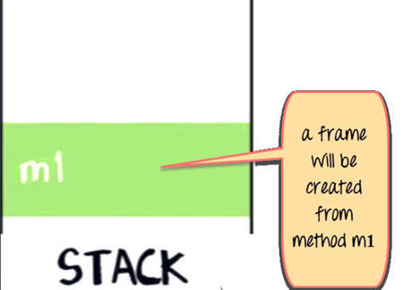

Một biến **x** trong **m1** cũng sẽ được tạo trong vùng **m1** trong Stack.

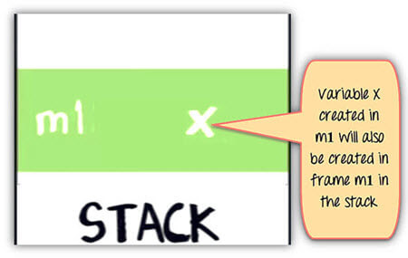

Method **m1** gọi đến method **m2**, trong Stack, một vùng mới được tạo cho **m2** ở phía trên vùng của **m1**

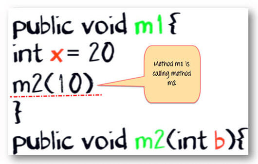

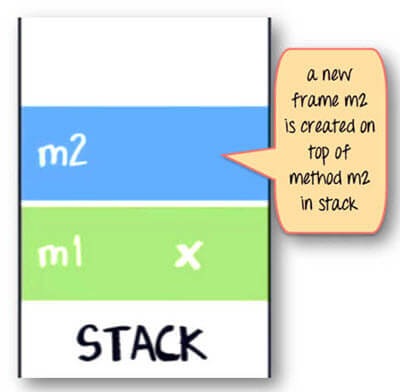

Biến **b** và **c** cũng được tạo trong vùng **m2** trong Stack

```java
public void m2(int b){
boolean c;
}
```
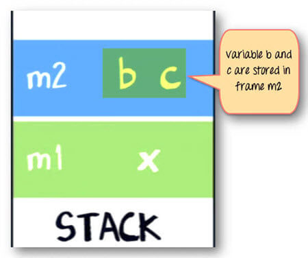

Giống với method **m2** gọi đến method **m3**, Một lần nữa, một vùng **m3** được tạo phía trên cùng của Stack. Xem hình dưới

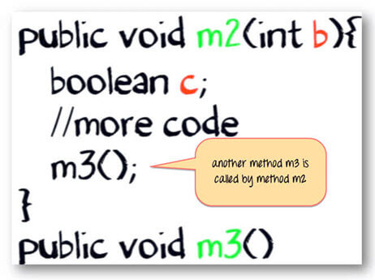

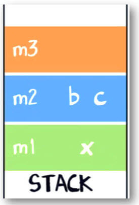

Bây giờ, nói với method **m3** của chúng ta tạo một object cho class **Account**, object có 2 biến instance **q** và **p**

```java
Account {
             Int p;
             Int q;
       }
```

Đây là code cho method **m3**

```java
public void m3(){
	Account ref = new Account();
	// more code
}
```

Lệnh **new** Account sẽ tạo một đối tượng bên trong Heap

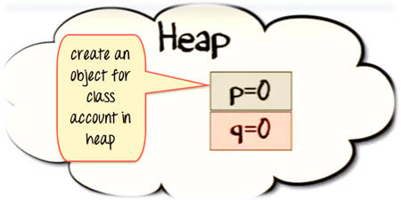

Mà một biến tham chiếu **ref** sẽ được tạo ở Stack Java

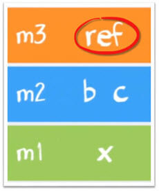

Và gán toán tử **=** để chỉ một biến tham chiếu đến một object trong Heap

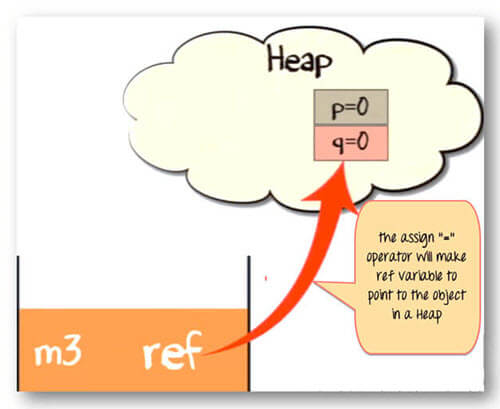

Khi method đã hoàn thành việc thực thi. Luồng điều khiển sẽ trả về lại cho method gọi. Trong trường hợp này là **m2**

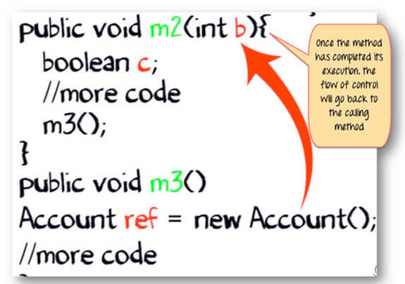

Và Stack của **m3** sẽ được lấy ra.

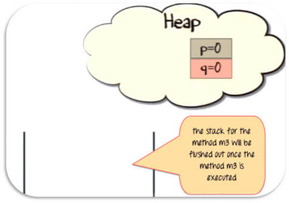

Vì biến tham chiếu trong **m3** đã không còn trỏ đến object trong Heap, nên nó đủ điều kiện để được thu gom(rác)

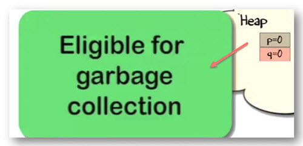

Một khi method **m2** hoàn thành việc thực thi, nó cũng sẽ bị lấy ta khỏi stack. Và tất cả các biến của nó cũng được lấy ra, không còn có sẵn để sử dụng.

Nó cũng giống với method **m1**

Cuối cùng, luồng điều khiển sẽ được trả về cho điểm bắt đầu của chương trình. Thông thường là method **main**

# Điều gì xảy ra nếu Object có một tham chiếu là biến instance của chính nó

```java
public static void main(String args[]) {
  A parent = new A(); 
  //more code 
  } 
  class A{
      B child = new B();
       int e;
        //more code 
   } 
   class B{
       int c; int d; 
        //more code 
      }
```

Trong trường hợp này, tham chiếu **child** sẽ được tạo trong Heap, nó sẽ chỉ đến object của chính nó. Như mô tả ở hình dưới đây.

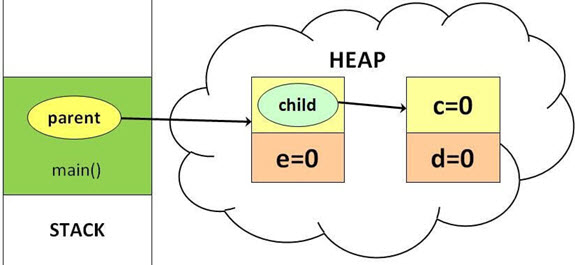

# Tổng kết:

- Khi một method được gọi, một vùng mới sẽ được tạo ở trên cùng của Stack
- Một khi method đã hoàn thành việc thực khi, luồng điều khiển sẽ trả về cho method gọi, và vùng tương ứng với method hoàn thành sẽ bị xóa khỏi Stack
- Biến local sẽ được tạo trong Stack
- Biến Instance sẽ được tạo trong Heap, và một phần object mà nó chứa.
- Biến tham chiếu được tạo trong Stack

[Back](./)
