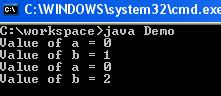

Biến và method static trong Java
---

Static trong Java có thể là:
1. Biến static
2. Method static
3. Block code static

# Biến static trong Java là gì ?
Biến static trong Java là biến thuộc về class, được khởi tạo một lần lúc khởi chạy chương trình.
- Nó là một biến thuộc về class, không thuộc về object(instance)
- Biến static được khởi tạo một lần, ngay lúc khởi chạy chương trình. Các biến này sẽ được khởi tạo đầu tiên, sau đó đến các biến instance
- Một bản copy sẽ được chia sẻ bởi các instance của class.
- Một biến static có thể truy cập trực tiếp thông qua tên class mà không cần bất cứ object nào.
## Cú pháp:
```java
<class-name>.<variable-name>
```

# Method static trong Java là gì ?
Static method trong Java là method thuộc về class, không thuộc về đối tượng. Một method static chỉ có thể truy cập data static.
- Nó là một method thuộc về class, không thuộc về object(instance)
- Một method static chỉ có thể truy cập biến static. Nó không thể truy cập biến non-static(biến instance)
- Một method static chỉ có thể gọi bởi các method static khác, và không thể gọi các method non-static khác.
- Một method static có thể được gọi trực tiếp từ class mà không cần bất cứ object nào.
- Một method static thì không thể tham chiếu đến **this** và **super**
## Cú pháp:
```java
<class-name>.<method-name>
```

**Lưu ý**: Method **main** là static, vì nó cần để một ứng dụng có thể chạy, trước bất kỳ sự khởi tạo nào diễn ra.

# Ví dụ: Làm thế nào để gọi biến static và method static
**Step 1**: Copy đoạn mã sau vào editor:
```java
public class Demo{
   public static void main(String args[]){
     Student s1 = new Student();
     s1.showData();
     Student s2 = new Student();
     s2.showData();
     //Student.b++;
     //s1.showData();
  }
}

class Student {
int a; //initialized to zero
static int b; //initialized to zero only when class is loaded not for each object created.

  Student(){
   //Constructor incrementing static variable b
   b++;
  }

   public void showData(){
      System.out.println("Value of a = "+a);
      System.out.println("Value of b = "+b);
   }
//public static void increment(){
//a++;
//}

}
```

**Step 2**: Lưu lại, biên dịch và khởi chạy

**Step 3**: Kiểm tra kết quả



Như sơ đồ bên dưới, như vậy biến tham chiếu và đối tượng đã được tạo, biến static được truy cập bởi 2 tham chiếu khác nhau.


**Step 4**: Nó khả thi để truy cập một biến static từ bên ngoài class sử dụng cú pháp **ClsasName.Variable_Name** Bỏ comment đoạn mã bên dưới và chạy lại.
```java
    Student.b++;
    s1.showData();
```
Kết quả:
```java
Value of a = 0
Value of b = 1
Value of a = 0
Value of b = 2
Value of a = 0
Value of b = 3
```

**Step 5**: Bỏ comment đoạn mã, biên dịch và chạy lại.
```java
public static void increment(){
  a++;
}
```
Kết quả:
```java
error: non-static variable a cannot be referenced from a static context a++; 
```

**Step 6**: Lỗi là gì ? Đó là vì nó là không khả thi để truy cập biến **a** từ method static **increment**

# Block static
Block static là một block của các tập lệnh bên trong một class, mà sẽ được thực thi khi một class được load vào JVM lần đầu tiên.
```java
class Test{
 static {
 //Code goes here
 }
}
```

**Block static** nó giúp khởi tạo các **biến static** trong class, nó giống như **contructor** giúp khởi tạo giá trị cho **biến instance**

Tham khảo ví dụ bên dưới để hiểu về static block

## Ví dụ: Làm thế nào để truy cập static block
```java
public class Demo {
 static int a;
 static int b;
 static {
    a = 10;
    b = 20;
 }
 public static void main(String args[]) {

  System.out.println("Value of a = " + a);
  System.out.println("Value of b = " + b);

 	}
}
```

Kết quả: 
```java
Value of a = 10
Value of b = 20
```

[Back](./)
