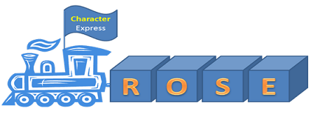
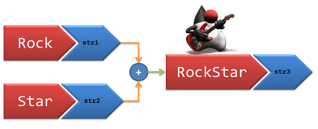

# String trong Java
--
# String là gì 
Một String theo nghĩa đen là một chuỗi các ký tự. Nó không phải là kiểu dữ liệu nguyên thủy. Về mặt kỹ thuât, String là một mảng các ký tự. 
Vì vậy, một chuỗi **ROSE** có thể được biểu diễn như sau:



# Vì sao phải dùng String
Một trong các chức năng chính của khoa học máy tính hiện đại là xử lý ngôn ngữ con người.

Cũng giống như các con số quan trọng với toán học và các ký hiệu thì đều có ý nghĩa. Mặc dù chúng ta có thể không nhìn thấy các xử lý của máy tính nhưng máy tính xử lý ngôn ngữ ở chế độ nền một cách chính xác. Các hộp thoại cung cấp các hướng dẫn, các menu cung cấp các lựa chọn. Và dữ liệu sẽ hiển thị các trạng thái, lỗi, và thay đổi theo thời gian thực.

Đối với lập trình viên Java, một trong những công cụ chính để lưu trữ và xử lý ngôn ngữ là String class

# Ví dụ về cú pháp String
Bây giờ, chúng ta sẽ tìm hiểu một vài cú pháp, sau tất cả, chúng ta sẽ cần nó để viết mã Java phải không ?

String là một mảng các ký tự, nó sẽ được biểu diễn như sau:

```java
//String is an array of characters
char[] arrSample = {'R', 'O', 'S', 'E'};
String strSample_1 = new String (arrSample);
```

Về mặt kỹ thuật, String đã được khai báo như sau trong ví dụ trên.
```java
= new (argument);
```

Bây giờ, chúng ta không thể luôn viết String của chúng ta như một mảng, vì thế chúng ta có thể khai báo String trong Java như sau:

```java
//Representation of String
String strSample_2 = "ROSE";
```

Về mặt kỹ thuật, ở trên đại diện cho điều này:

```java
= ;
```

String class kế thừa Object class trong java.

# String Concatenation
Concatenation là ghép 2 hoặc nhiều String

Hãy nhìn vào bức hình sau:



Chúng ta có 2 chuối, str1 = "Rock" và str2 = "Star".
Nếu chúng ta thêm 2 chuỗi này, chúng ta sẽ có một kết quả str3 = "RockStart".
Kiểm tra đoạn mã dưới đây, và nó giải thích 2 method để xử lý nỗi chuỗi.

Đầu tiên là sử dụng method **concat** của String class và thứ 2 là sử dụng toán tử **+**. Cả 2 kết quả đều là giống nhau.

```java
public class Sample_String{
  public static void main(String[] args){
//String Concatenation
String str1 = "Rock";
String str2 = "Star";
//Method 1 : Using concat
String str3 = str1.concat(str2);
System.out.println(str3);
//Method 2 : Using "+" operator
String str4 = str1 + str2;
System.out.println(str4);
}
}
```

# Các method quan trọng khác


Hãy hỏi String class một vài câu hỏi và xem liệu nó có thể trả lời chúng.

## String "Length" Method
Làm thế nào để bạn xác định độ dài của một String ? I cung cấp cho bạn một method được gọi là **length**. Sử dụng chúng đối với String bạn cần tìm độ dài.

```java
public class Sample_String{
  public static void main(String[] args){  //Our sample string for this tutorial
  String str_Sample = "RockStar";
  //Length of a String
  System.out.println("Length of String: " + str_Sample.length());}}
```
Kết quả:

```java
Length of String: 8
```

## String "indexOf" Method
Nếu tôi biết độ dài của String, làm thế nào tôi tìm thấy ký tự ở vị trí nào. Ngắn gọn hơn, làm thế nào bạn tìm thấy chỉ mục của một ký tự ?

Bạn đã tự trả lời, có một method **indexOf** sẽ giúp bạn xác định vị trí của ký tự cụ thể mà bạn chỉ định.

```java
public class Sample_String{
  public static void main(String[] args){//Character at position
String str_Sample = "RockStar";
System.out.println("Character at position 5: " + str_Sample.charAt(5));
//Index of a given character
System.out.println("Index of character 'S': " + str_Sample.indexOf('S'));}}
```
Kết quả:

```java
Character at position 5: t
Index of character 'S': 4
```

## String "charAt" Method
Cũng giống câu hỏi trên, cho một index, làm thế nào để tôi biết ký tự ở vị trí đó ?

Thật đơn giản, sử dụng method **charAt** và cung cấp index của ký tự mà bạn muốn tìm.

```java
public class Sample_String{
  public static void main(String[] args){//Character at position
String str_Sample = "RockStar";
System.out.println("Character at position 5: " + str_Sample.charAt(5));}}
```
Kết quả:

```java
Character at position 5: t
```

## String "CompareTo" Method
Tôi muốn kiểm tra xem String mà được tạo bởi một vài method có bằng với một String mà tôi muốn kiểm chứng. Làm thế nào để tôi so sánh 2 chuỗi String ?

Sử dụng method **compareTo** và chỉ định String mà bạn muốn so sánh.

Sử dụng method **compareToIgnoreCase** trong trường hợp bạn không muốn có kết quả so sánh ký tự hoa thường.

Kết quả so sánh là 0 nếu 2 String bằng nhau. Nhỏ hơn 0 nếu String so sánh nhỏ hơn String tham số, và lớn hơn 0 khi String so sánh lớn hơn String tham số.

```java
public class Sample_String{
  public static void main(String[] args){//Compare to a String
String str_Sample = "RockStar";
  System.out.println("Compare To 'ROCKSTAR': " + str_Sample.compareTo("rockstar"));
  //Compare to - Ignore case
  System.out.println("Compare To 'ROCKSTAR' - Case Ignored: " + str_Sample.compareToIgnoreCase("ROCKSTAR"));}}
```
Kết quả:

```java
Compare To 'ROCKSTAR': -32
Compare To 'ROCKSTAR' - Case Ignored: 0
```

# String "Contain" Method
Tôi biết 1 phần những gì mà String chứa. Làm thế nào để tôi xác nhận được String có chứa một chuối các ký tự mà tôi chỉ định ?

Sử dụng method **contain** và chỉ định một chuối ký tự bạn cần phải kiểm tra.

Trả về **true** nếu và chỉ nếu String có chứa chuỗi các ký tự được chỉ định.

```java
public class Sample_String{
  public static void main(String[] args){  //Check if String contains a sequence
String str_Sample = "RockStar";
  System.out.println("Contains sequence 'tar': " + str_Sample.contains("tar"));}}
```
Kết quả:

```java
Contains sequence 'tar': true
```

## String "endsWith" Method
Làm thế nào tôi xác nhận nếu String kết thúc với một phần hậu tố. Một lần nữa bạn đã trả lời nó. Sử dụng method **endsWith** và chỉ định hậu tố vào tham số.

Trả về **true** nếu chuỗi ký tự đại diện cho tham số là một hậu tố của một chuỗi ký tự đại diện cho đối tượng String.

```java
public class Sample_String{
  public static void main(String[] args){  //Check if ends with a particular sequence
String str_Sample = "RockStar";
  System.out.println("EndsWith character 'r': " + str_Sample.endsWith("r"));}}
```
Kết quả:

```java
EndsWith character 'r': true
```

# String "replaceAll" & "replaceFirst" Method
Tôi muốn sửa đổi String của tôi tại một số nơi và thay thế một số phần của chuỗi.

Java String Replace, method **replaceAll** và **replaceFirst**. Bạn có thể chỉ định một phần của String bạn muốn thay thế và chuỗi thay thế vào tham số.

```java
public class Sample_String{
  public static void main(String[] args){//Replace Rock with the word Duke
String str_Sample = "RockStar";
System.out.println("Replace 'Rock' with 'Duke': " + str_Sample.replace("Rock", "Duke"));}}
```
Kết quả:

```java
Replace 'Rock' with 'Duke': DukeStar
```

## String Java "tolowercase" & Java "touppercase" Method
Tôi muốn toàn bộ String của tôi hiển thị dưới dạng chữ hoa hoặc chữ thưởng ?

Hãy dùng **tolowercase()** và **touppercase()** đối với String cần phải chuyển đổi.

```java
public class Sample_String{
  public static void main(String[] args){//Convert to LowerCase
String str_Sample = "RockStar";
System.out.println("Convert to LowerCase: " + str_Sample.toLowerCase());
//Convert to UpperCase
System.out.println("Convert to UpperCase: " + str_Sample.toUpperCase());}}
```
Kết quả:

```java
Convert to LowerCase: rockstar
Convert to UpperCase: ROCKSTAR
```

# Một số lưu ý quan trọng:
- **String là một Final class**: Một khi được tạo, giá trị không thể sửa đổi. Vì thế, đối tượng String được gọi là bất biến.
- JVM tạo một vị trí bộ nhớ đặc biệt cho String được gọi là **String Constant Pool**. Đó là lý do tại sao String có thể khởi tạo mà không cần từ khóa **new**
- String class nằm trong hệ thống thứ cấp **java.lang.String**. Nhưng không cần **import** class này. Java platform sẽ nhận nó một cách tự động.
- Tham chiếu của String có thể được ghi đè, tuy nhiên không thể xóa nội dung của nó.

  ```java
  String h1 = "hello"
  h1 = "hello" + "world"
  ```
  Ở đây, String **hello** không bị xóa đi. Nó chỉ không có cái gì tham chiếu đến nó nữa.
- Multiple references có thể được sử dụng cho nhiều String nhưng nó sẽ xảy ra ở cùng một nơi.

  ```java
  String h1 = "hello";
  String h2 = "hello";
  String h3 = "hello";
  ```
  Chỉ có một String **hello** được tạo trong vùng nhớ String Pool và có 3 tham chiếu h1, h2, h3 cùng tham chiếu đến nó.
- Nếu một số được viết trong **""** thì nó sẽ trở thành String, không phải là một số nữa. Có nghĩa là:

  ```java
  String S1 ="The number is: "+ "123"+"456";
  System.out.println(S1);
  ```
  Thì nó sẽ hiển thị: 
  
  ```java
  The number is: 123456
  ```

  Nếu được khởi tạo thế này:
  
  ```java
  String S1 = "The number is: "+(123+456);
  System.out.println(S1);
  ```
  Thì nó sẽ hiển thị: 
  
  ```java
  The number is:579 
  ```

Đó là tất cả với String.

[Back](./)
