# Từ khóa THIS trong Java là gì
Từ khóa **THIS** là một biến tham chiếu trong Java dùng tham chiếu đến đối tượng hiện tại.

Các cách sử dụng khác nhau của **THIS** trong Java như sau:
- Nó có thể sử dụng để tham chiếu đến một biến thể hiện(instance variable) của class hiện tại
- Nó có thể sử dụng để gọi hoặc khởi tạo constructor của class hiện tại
- Nó có thể được truyền như một tham số trong method gọi
- Nó có thể được truyền như một tham số trong constructor gọi
- Nó có thể được dùng để trả về thể hiện của class hiện tại

# Tìm hiểu từ khóa THIS với ví dụ

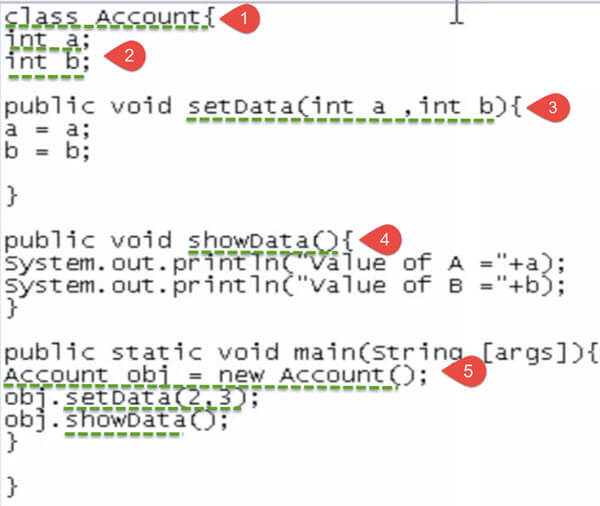

1. Class: class Account
2. Instance Variable: a và b
3. Method Set data: Để set giá trị cho a và b
4. Method Show data: Để hiển thị giá trị a và b
5. Main method: Nơi mà chúng ta tạo một object của class Account và gọi method set data và show data.

Biên dịch source code và chạy thử.

Kết quả mong muốn của chúng ra cho A và B nên được khởi tạo giá trị 2 và 3 tương ứng.

Nhưng giá trị là 0. Tại sao? Hãy điều tra xem.

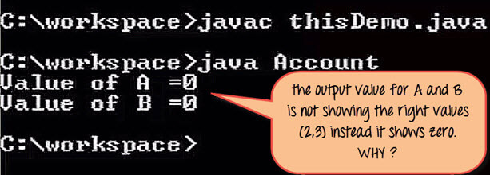

Trong method Set data, các tham số được khai báo là a và b, trong khi instance biến cũng có tên là a và b.

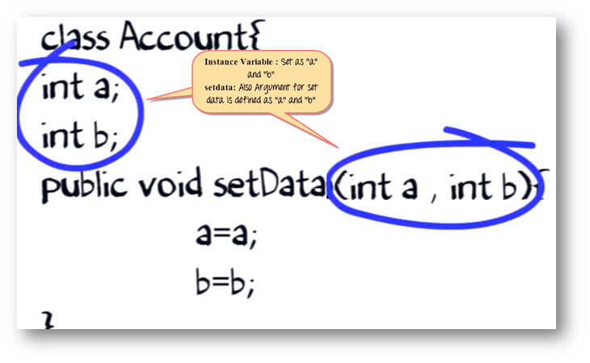

Trong khi thực thi, trình biên dịch hơi bối rối. Liệu "a" bên trái của toán tử là instance biến hay local biến. Tóm lại, nó không set giá trị của "a" khi method set data được gọi.

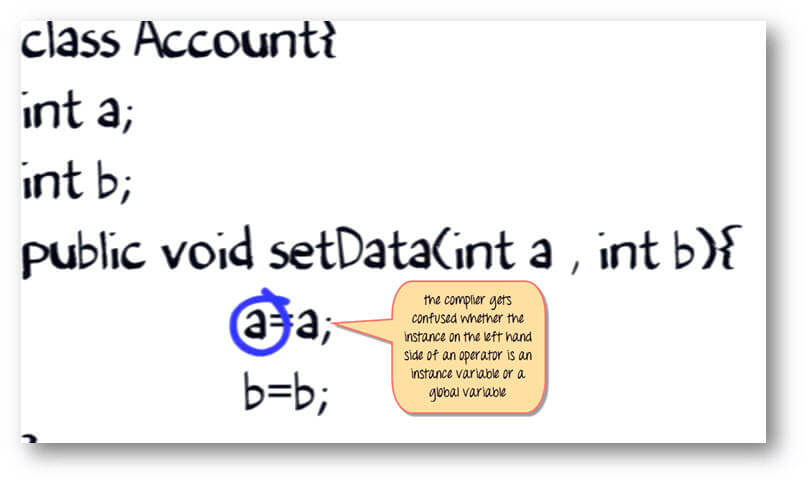

Giải pháp là từ khóa **THIS**.

Thêm vào cho cả 2 a và b từ khóa **this**, theo sao bởi toán tử chấm (**.**)

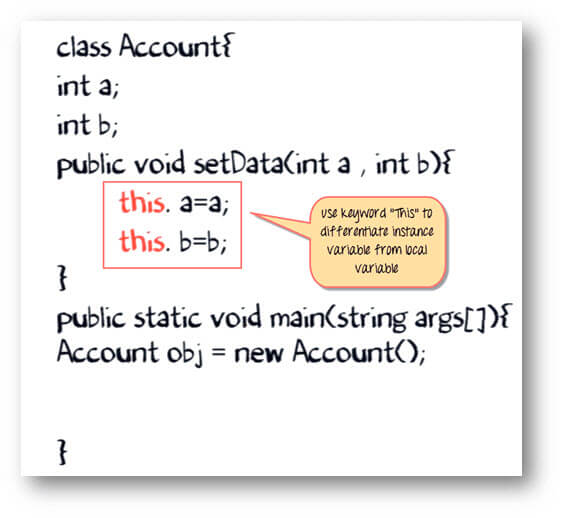

Trong khi thực thi code, khi một đối tượng gọi method "sendData". Từ khóa **this** sẽ được thay thế bởi đối tượng xử lý "obj". Xem hình bên dưới.

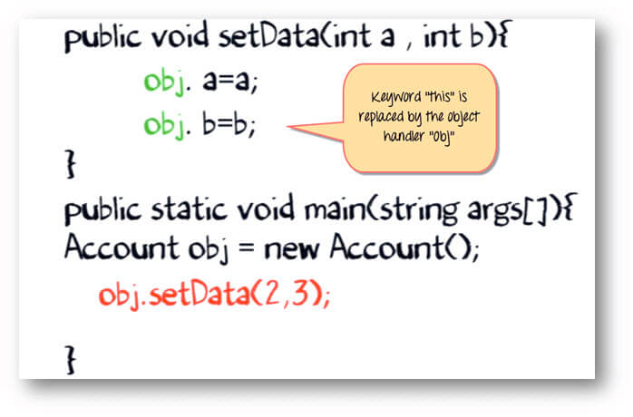

Bây giờ, trình biên dịch sẽ biết rằng:
- "a" phía bên tay trái là biến instance
- Trong khi, "a" bên tay phải là biến local

Các biến sẽ được khởi tạo chính xác, và kết quả mong muốn sẽ được hiển thị.

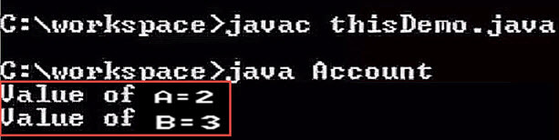

Giả sử, bạn đủ thông minh để chọn tên biến khác nhau cho biến instance và tham số của method.

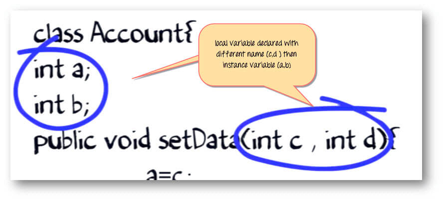

Nhưng trong lúc này, bạn tạo 2 đối tượng của class Account, mỗi đối tượng đều gọi đến method sendData.

Làm thế nào để trình biên dịch xác định được khi nào thì nó làm việc trên object 1 hay object 2.

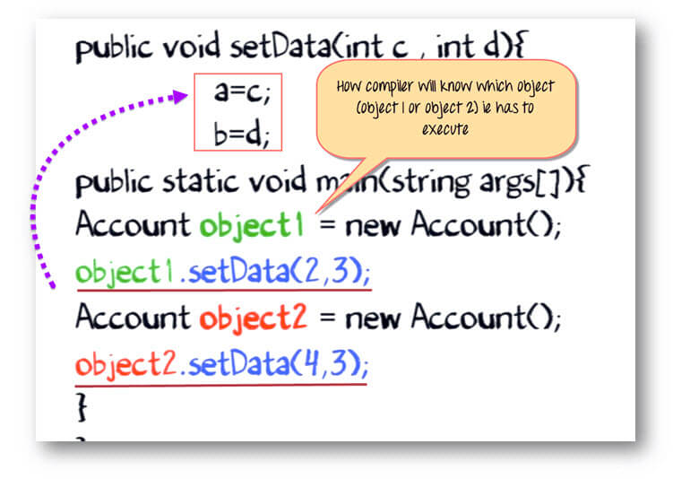

Đúng vậy,  trình biên dịch sẽ tự động ngầm thêm vào instance biến từ khóa **THIS** như hình sau:

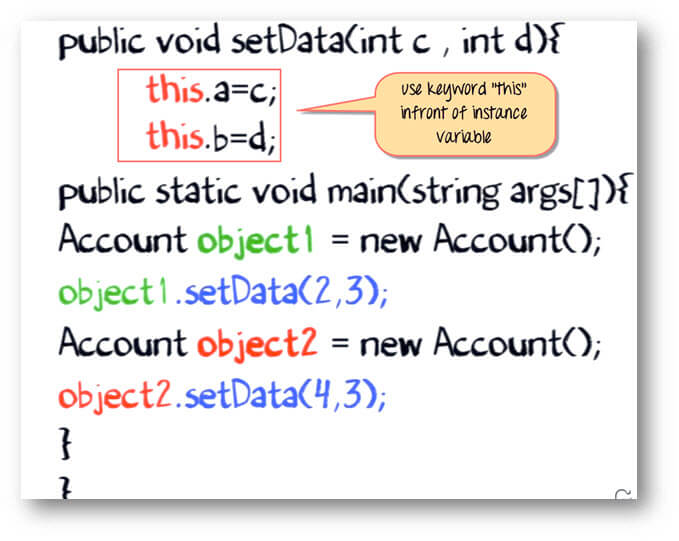

Như vậy, khi object 1 gọi đến method sendData, một biến instance sẽ được thêm một biến tham chiếu đến object đó.

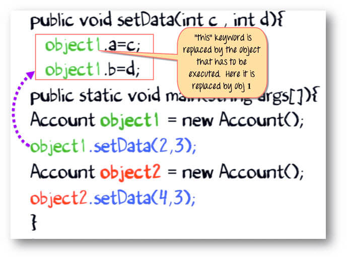

Trong khi object 2 gọi đến method sendData, một biến tham chiếu đến object 2 sẽ được thêm vào.

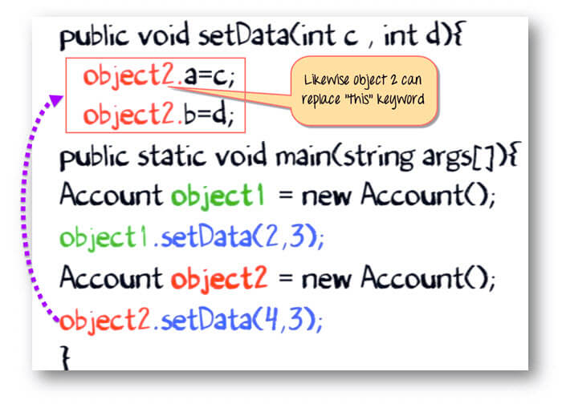

Quá trình này sẽ được xử lý bởi chính compiler, bạn không cần phải thêm từ khóa **THIS** một cách rõ ràng ngoại trừ trường hợp ngoại lệ như trong ví dụ của chúng tôi.

# Ví dụ: Để hiểu về từ khóa THIS
**Step 1**: Copy đoạn mã sau vào notepad:

```java
class Account{
int a;
int b;

 public void setData(int a ,int b){
  a = a;
  b = b;
 }
 public void showData(){
   System.out.println("Value of A ="+a);
   System.out.println("Value of B ="+b);
 }
 public static void main(String args[]){
   Account obj = new Account();
   obj.setData(2,3);
   obj.showData();
 }
}
```

**Step 2**: Lưu lại, biên dịch và chạy nó.

**Step 3**: Giá trị của a và b được hiển thị có phải là 0? Để chỉnh sửa lỗi đó, hãy thêm từ khóa **this** vào line 6 và 7

```java
this.a =a;
this.b =b;
```

**Step 4**: Lưu, biên dịch và chạy lại. Lúc này, a và b đã hiển thị giá trị 2 và 3 tương ứng.

# Tổng kết:
- Từ khóa THIS trong Java là một biến tham chiếu, tham chiếu đến đối tượng hiện tại
- Nó có thể dùng để tham chiếu biến instance của class hiện tại
- Nó có thể dùng để gọi hoặc khởi tạo constructor của class hiện tại
- Nó có thể được truyền đi như là một tham số trong method được gọi
- Nó có thể được truyền đi như là một tham số trong constructor
- Nó có thể được dùng để trả về một instance của class hiện tại
- "THIS" là tham chiếu của đối tượng hiện tại, đối tượng của method đang được gọi.
- Bạn có thể sử dung từ khóa THIS để bỏ qua lỗi xung đột tên biến trong method/constructor trong đối tượng của bạn.

[Back](./)
