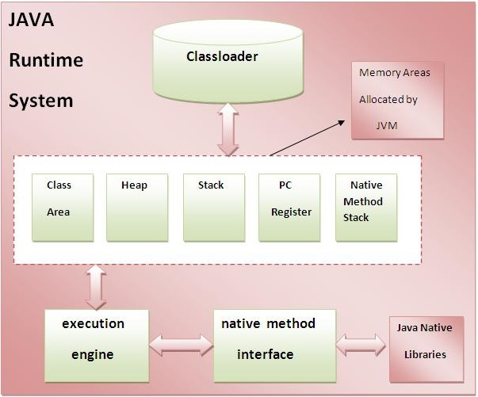
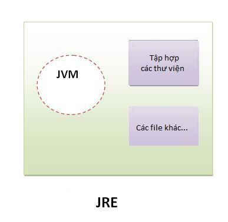
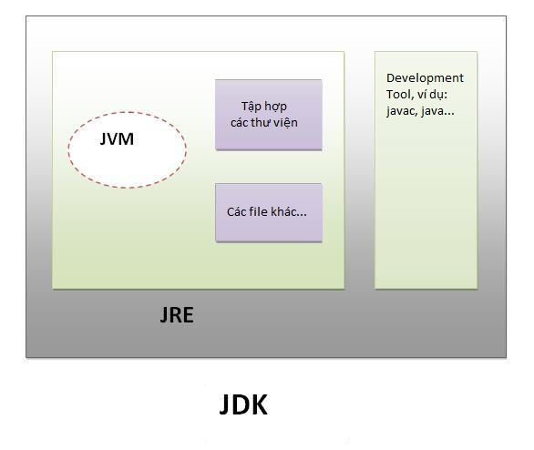

## Sự khác nhau giữa JDK,JRE và JVM?
### Tìm hiểu JVM

JVM (viết tắt của Java Virtual Machine) là một thiết bị trừu tượng (ảo) có thể giúp máy tính chạy các chương trình Java. Nó cung cấp môi trường runtime mà trong đó Java Bytecode có thể được thực thi.
JVM là có sẵn cho nhiều nền tảng (Windows, Linux...). JVM, JRE và JDK là phụ thuộc nền tảng, bởi vì cấu hình của mỗi OS (hệ điều hành) là khác nhau. Nhưng, Java là độc lập nền tảng.
### Các nhiệm vụ chính của JVM

* Tải code
* Kiểm tra code
* Thực thi code
* Cung cấp môi trường runtime

Cấu trúc của JVM



 Trong đó:

* __Classloader__: Là một hệ thống con của JVM được sử dụng để tải class file.
    Class (method) Area: Lưu trữ cấu trúc mỗi lớp, chẳng hạn như hằng, trường, dữ liệu phương thức, code của phương thức, ...
* __Heap__: Nó là khu vực dữ liệu runtime mà trong đó đối tượng được cấp phát.
* __Stack__: Stack trong Java lưu giữ các Frame. Nó giữ các biến cục bộ và các kết quả cục bộ, và thực hiện một phần nhiệm vụ trong phần triệu hồi và trả về phương thức. Mỗi Thread có một Stack riêng, được tạo tại cùng thời điểm với Thread.
    Một Frame mới được tạo mỗi khi một phương thức được triệu hồi và bị hủy khi lời triệu hồi phương thức là kết thúc.
* __Program Counter Register__: Nó chứa địa chỉ của chỉ lệnh JVM hiện tại đang được thực thi.
* __Native Method Stack__: Bao gồm tất cả các phương thức tự nhiện được sử dụng trong ứng dụng.
* __Execution Engine__: Phần này bao gồm:
  * Một bộ xử lý ảo Virtual Processor
  * Một trình thông dịch Interpreter. Đọc Bytecode Stream sau đó thực thi các chỉ thị.
* __Just-In-Time (JIT) Compiler__: được sử dụng để cải thiện hiệu suất. JIT biên dịch các phần của Bytecode mà có cùng tính năng tại cùng một thời điểm, và vì thế giảm lượng thời gian cần thiết để biên dịch. Ở đây khái niệm Compiler là một bộ biên dịch tập chỉ thị của JVM thành tập chỉ thị của một CPU cụ thể.

### Tìm hiểu JRE 


 
__JRE (là viết tắt của Java Runtime Environment)__ được sử dụng để cung cấp môi trường runtime. Nó là trình triển khai của JVM. JRE bao gồm tập hợp các thư viện và các file khác mà JVM sử dụng tại runtime. Trình triển khai của JVM cũng được công bố bởi các công ty khác ngoài Sun Micro Systems.
Tìm hiểu JDK 



>JDK (là viết tắt của Java Development Kit) bao gồm JRE và các Development Tool. 


## Trình biên dịch JIT là gì?
Trình biên dịch JIT (Just-In-Time) được sử dụng để tăng hiệu suất biên dịch chương trình. Trình JIT biên dịch từng phần của byte code có chức năng giống nhau tại cùng một thời điểm, do đó sẽ giảm được thời gian biên dich. Ở đây, thuật ngữ "trình biên dịch" dùng để chỉ trình dịch từ tập lệnh của một máy ảo Java (JVM) tới tập lệnh của một CPU cụ thể.
## Platform là gì?
Bất cứ môi trường phần cứng hoặc phần mềm nào mà trong đó có một chương trình chạy, thì được hiểu như là một Platform. Với môi trường runtime riêng cho mình (JRE) và API, Java được gọi là Platform
## Sự khác nhau giữa Java platform và các platform khác?
Java platform khác với hầu hết các nền tảng khác theo nghĩa nó là một nền tảng dựa trên phần mềm chạy trên các nền tảng phần cứng khác. Nó có hai thành phần:

* Môi trường thực thi (Runtime)
* API(Application Programming Interface)

## Tính chất "viết một lần chạy nhiều nơi" của java là gì?
Java code được biên dịch thành một byte code, là ngôn ngữ trung gian giữa mã nguồn và mã máy. Byte code này không phải là nền tảng cụ thể và do đó có thể được thông dịch cho bất kỳ nền tảng nào.
## Classloader trong java là gì?
Classloader là một hệ thống con của JVM được sử dụng để tải các lớp và các interface. Có rất nhiều loại Classloader ví dụ: Bootstrap classloader, Extension classloader, System classloader, Plugin classloader...
## Sự khác nhau giữa bộ nhớ heap và stack trong java?
@see https://viettuts.vn/interview/list-cau-hoi-phong-van-java-core-2

>Stack là một vùng nhớ được sử dụng để lưu trữ các tham số và các biến local của phương thức mỗi khi một phương thức được gọi ra.

>Heap là một vùng nhớ trong bộ nhớ được sử dụng để lưu trữ các đối tượng khi từ khóa new được gọi ra, các biến static và các biến toàn cục (biến instance). 

## File có tên trống ".java" có hợp lệ không?

Có, bạn có thể lưu file java với tên ".java", sau đó biên dịch bằng lệnh javac .java và chạy bằng lệnh java ten_lop. Ví dụ:

```java
class A{  
    public static void main(String args[]){  
        System.out.println("Hello java");  
    }
}  
```

Biên dịch: ```javac .java```

Run: java A 

## Các từ delete, next, main, exit và null có phải là từ khóa trong java không?

Không.

## Nếu không cung cấp bất kỳ đối số nào trên command line, thì mảng String của hàm main là empty hay null?

Mảng String là empty, không phải null. 

## Chuyện gì xảy ra nếu khai báo static public void thay vì public static void?

Chương trình được biên dịch và run đúng. 

## Giá trị mặc định của các biến local là gì?
Các biến local không được khởi tạo với bất kỳ giá trị mặc định nào, bất kể là nguyên thủy hay tham chiếu đối tượng.
# Java Core - các khái niệm về OPPs
---
### Sự khác biệt giữa ngôn ngữ lập trình hướng đối tượng và ngôn ngữ lập trình dựa trên đối tượng là gì?
Ngôn ngữ lập trình dựa trên đối tượng thực hiện theo tất cả các tính năng của OOPs ngoại trừ tính kế thừa. Ví dụ về các ngôn ngữ lập trình dựa trên đối tượng là JavaScript, VBScript,...
### Giá trị khởi tạo của biến tham chiếu đối tượng được định nghĩa là biến instance là gì?
Trong java, các tham chiếu của đối tượng được khởi tạo là null.
### Constructor được kế thừa không?
Không, constructor không được kế thừa.
### Có thể tạo constructor final không?
không, constructor không thể là final.
## Từ khóa static trong java
>Từ khóa static trong Java được sử dụng chính để quản lý bộ nhớ. Chúng ta có thể áp dụng từ khóa static với các biến, các phương thức, các khối, các lớp lồng nhau(nested class). Từ khóa static thuộc về lớp chứ không thuộc về instance(thể hiện) của lớp.

Trong java, Static có thể là:

>Biến static: Khi bạn khai báo một biến là static, thì biến đó được gọi là biến tĩnh, hay biến static.

>Phương thức static: Khi bạn khai báo một phương thức là static, thì phương thức đó gọi là phương thức static.

>Khối static: Được sử dụng để khởi tạo thành viên dữ liệu static.

### 1. Biến static trong Java
Khi bạn khai báo một biến là static, thì biến đó được gọi là biến tĩnh, hay biến static.

1. Biến static có thể được sử dụng để tham chiếu thuộc tính chung của tất cả đối tượng (mà không là duy nhất cho mỗi đối tượng), ví dụ như tên công ty của nhân viên, tên trường học của các sinh viên, ...
2. Biến static lấy bộ nhớ chỉ một lần trong Class Area tại thời gian tải lớp đó.

**Lợi thế của biến static**

Sử dụng biến static giúp chương trình của bạn sử dụng bộ nhớ hiệu quả hơn (tiết kiệm bộ nhớ).

Vấn đề khi không sử dụng biến static

```java
class Student{  
     int rollno;  
     String name;  
     String college="Bưu Chính Viễn Thông";  
} 
```
Giả sử có 1000 sinh viên trong trường đại học, bây giờ instance của các dữ liệu thành viên sẽ sự dụng bộ nhớ mỗi khi đối tượng được tạo. Tất cả sinh viên có rollno và name là thuộc tính riêng. Tuy nhiên, college là thuộc tính chung của tất cả đối tượng. Nếu chúng ta tạo nó là static, thì trường này sẽ chỉ sử dụng bộ nhớ một lần để lưu biến này.
>Ghi chú: Thuộc tính static trong Java được chia sẻ tới tất cả đối tượng.

### 2. Phương thức static trong Java
Nếu bạn áp dụng từ khóa static với bất cứ phương thức nào, thì phương thức đó được gọi là phương thức static.

Một phương thức static thuộc lớp chứ không phải đối tượng của lớp.
Một phương thức static gọi mà không cần tạo một instance của một lớp.
Phương thức static có thể truy cập biến static và có thể thay đổi giá trị của nó.

### Sự hạn chế của phương thức static
Có hai hạn chế chính đối với phương thức static. Đó là:

1. Phương thức static không thể sử dụng biến non-static hoặc gọi trực tiếp phương thức non-static.
2. Từ khóa this và super không thể được sử dụng trong ngữ cảnh static.

### 3. Khối static trong Java
1. Được sử dụng để khởi tạo thành viên dữ liệu static.
2. Nó được thực thi trước phương thức main tại lúc tải lớp.

### Chúng ta có thể thực thi một chương trình không có phương thức main() không?
Có, một cách khác là sử dụng khối static.

### Chuyện gì xảy ra khi phương thức main không có static?
Chương trình được biên dịch, nhưng gặp lỗi ngoại lệ tại runtime là "NoSuchMethodError".

### Sự khác nhau giữa phương thức static và phương thức instance?
Phương thức static|	Phương thức instance
----|----
|1)Một phương thức được khai báo với từ khóa static được gọi là phương thức static.|	Một phương thức không được khai báo với từ khóa static được gọi là phương thức instance.
2)Không cần tạo đối tượng cũng gọi được phương thức static thông qua class.	|Phải tạo đối tượng để gọi phương thức instance.
3)Biến non-static không được truy cập trực tiếp trong phương thức static (hoặc khối static).|	Biến static và non-static được truy cập trực tiếp trong phương thức instance.
4)Ví dụ: public static int cube(int n){ return n*n*n;}|	Ví dụ: public void msg(){...}.
### Tại sao đa kế thừa không được hỗ trợ trong java.
Để giảm thiểu sự phức tạp và đơn giản hóa ngôn ngữ, đa kế thừa không được support trong java.

### Composition là gì?
Khai báo biến tham chiếu của một class trong một class khác được gọi là composition(sự hợp thành).

### Sự khác nhau giữa aggregation và composition?
Aggregation biểu diễn mối quan hệ yếu, còn composition biểu diễn quan hệ chặt chẽ. Ví dụ: xe máy có một công tơ mét (aggregation), nhưng xe máy có một động cơ (composition).

### Có thể sử dụng cả this() và super() trong một constructor?
Không, vì this() gọi đến một constructor khác trong lớp hiện tại, còn super() gọi constructor của lớp cha.

There is a difference between super() and this().

* super()- calls the base class constructor whereas
* this()- calls current class constructor.

>Both this() and super() are constructor calls.
>
>Constructor call must always be the first statement. So you either have super() or this() as first statement.

Example (don't look for a sense in the parameters):

```java
class A {
  public A() {
    this( false );
  }

  public A(boolean someFlag) {
  }
}

class B extends A {
  public B() {
    super();
  }

  public B( boolean someFlag ) {
    super( someFlag );
  }

  public B ( int someNumber ) {
    this(); //
  }
} 
```
Now, if you call new B(5) the following constructors are invoked:

```java

     this( false);
A() ---------------> A(false)
^
|
| super(); 
|
|     this();
B() <--------------- B(5)  <--- you start here
```
Update:


If you were able to use this() and super() you could end up with something like this:

(Attention: this is meant to show what could go wrong, if you were allowed to do that - which you fortunately aren't)

```java
     this( false);
A() ---------------> A(false)
^                    ^
|                    |
| super();           | super( true ); <--- Problem: should the parameter be true or false? 
|                    |
|     this();        |
B() <--------------- B(5)  <--- you start here
```

### Overloading (nạp chồng) phương thức là gì?
Nếu một lớp có nhiều phương thức có tên giống nhau nhưng các tham số khác nhau, được gọi là overloading phương thức (nạp chồng phương thức). Nó giúp code rõ ràng, dễ hiểu hơn.

### Tại sao overloading phương thức không xảy ra khi thay đổi kiểu giá trị trả về?
Bởi vì đó là sự không rõ ràng, không biết gọi phương thức nào khi runtime.

### Có thể overload phương thúc main() không?
Có, có thể overload phương thức main().

### Ghi đè (overriding) phương thức là gì?
Nếu lớp con có phương thức giống lớp cha được gọi là ghi đè (overriding) phương thức trong java.

Nói cách khác, nếu lớp con cung cấp sự cài đặt cụ thể cho phương thức đã được cung cấp bởi một lớp cha của nó được gọi là ghi đè (overriding) phương thức trong java.
### Có thể ghi đè phương thức static không?
Bạn không thể ghi đè phương thức static vì chúng thuộc về class chứ không thuộc về đối tượng.
### Tại sao không thể ghi đè phương thức static?
Bởi vì phương thức static là một phần của lớp và nó bị ràng buộc với lớp, trong khi phương thức instance là bị ràng buộc với đối tượng, static được lưu trong vùng nhớ Class và instance được lưu trong bộ nhớ heap.
### Có thể ghi đè phương thức đã nạp chồng?
Có.
### Có thể ghi đè biến instance không?
Không.
### Sự khác nhau giữa nạp chồng và ghi đè là gì?
No.|	Nạp chồng phương thức (overloading)|	Ghi đè phương thức (overriding)|
|----|----|----|
1)	|Nạp chồng phương thức được sử dụng để giúp code của chương trình dễ đọc hơn.	|Ghi đè phương thức được sử dụng để cung cấp cài đặt cụ thể cho phương thức được khai báo ở lớp cha.
2)	|Nạp chồng được thực hiện bên trong một class.|	Ghi đè phương thức xảy ra trong 2 class có quan hệ kế thừa.
3)	|Nạp chồng phương thức thì tham số phải khác nhau.|	Ghi đè phương thức thì tham số phải giống nhau.
4)	|Nạp chồng phương thức là ví dụ về đa hình lúc biên dịch.|	Ghi đè phương thức là ví dụ về đa hình lúc runtime.
5)	|Trong java, nạp chồng phương thức không thể được thực hiện khi chỉ thay đổi kiểu giá trị trả về của phương thức. Kiểu giá trị trả về có thể giống hoặc khác. Giá trị trả về có thể giống hoặc khác, nhưng tham số phải khác nhau.	|Giá trị trả về phải giống nhau
### Biến final là gì?
Nếu bạn tạo một biến với từ khóa final, bạn sẽ không thể thay đổi được giá trị của biến đó (hằng số).
### Phương thức final là gì?
Phương thức final không thể được ghi đè.
### Lớp final là gì?
Lớp final không thể được kế thừa.
### Biến final blank là gì?
Một biến final không được khởi tạo giá trị lúc khai báo được gọi là biến final blank.
### Có thể khởi tạo giá trị cho biến final blank không?
Có, nếu biến đó là non-static thì chỉ khởi tạo được trong constructor. Nếu biến đó là static thì chỉ khởi tạo được trong khối static.
### Có thể khai báo phương thức main là final không?
Có, giống như: ```public static final void main(String[] args){}```
### Đa hình tại runtime là gì?
Đa hình tại runtime là quá trình gọi phương thức đã được ghi đè trong thời gian thực thi chương trình. Trong quá trình này, một phương thức được ghi đè được gọi thông qua biến tham chiếu của một lớp cha.
### Có thể thực hiện đa hình lúc runtime với các thành viên dữ liệu không?
Không.
### Sự khác nhau giữa ràng buộc tĩnh và ràng buộc động là gì?
Kiểu ràng buộc tĩnh của đối tượng được xác định tại lúc biên dịch, còn kiểu ràng buộc động của đối tượng được xác định tại runtime.
### Sự khác nhau giữa lớp abstract và interface là gì?
STT|Lớp Abstract	|Interface
----|----|----
|1)|Một lớp abstract có thể có phương thức có nội dung (các phương thức tường minh).	|Interface chỉ có các phương thức trừu tượng.
2)|Một lớp abstract có thể có các biến instance.	|Một interface không thể có các biến instance.
3)|Một lớp abstract có thể có constructor.	|Một interface không thể có constructor.
4)|Một lớp abstract có thể có các phương thức static.	|Một interface không thể có các phương thức static.
5) |Một lớp chỉ có thể extends một lớp abstract.	|Một lớp thể implement nhiều interface.
### Có thẻ định nghĩa private hoặc protected cho các biến trong interface không?
Không. chúng phải là public.
### Khi nào một tham chiếu đối tượng có thể được ép sang kiểu interface tham chiếu?
Một tham chiếu đối tượng có thể được ép sang kiểu interface tham chiếu khi đối tượng đó implements interface được tham chiếu.
### Static import là gì?
Với static import, chúng ta có thể truy cập đến các thành viên của một lớp một cách trực tiếp. Không cần phải sử dụng tên class cũng có thể truy cập.
### Xử lý ngoại lệ (handling exception) là gì?
Exception Handling trong java hay xử lý ngoại lệ trong java là một cơ chế mạnh mẽ để xử lý các lỗi runtime để có thể duy trì luồng bình thường của ứng dụng.
### Sự khác biệt giữa checked exception và unchecked exception là gì?
Checked exception|Unchecked exception
-----|-----
Các lớp được extends lớp Throwable ngoại trừ RuntimeException và Error được gọi là các checked exception. Ví dụ: IOException, SQLException, ... Checked exception được kiểm tra tại thời gian biên dịch.|Các lớp được extends lớp RuntimeException được gọi là unchecked exception. Ví dụ như ArithmeticException, NullPointerException, ... Unchecked exception không được kiểm tra tại thời gian biên dịch.
### Có phải mỗi khối try phải đi kèm với một khối catch?
Nó không phải là cần thiết mà mỗi khối ```try``` phải được theo sau bởi một khối ```catch```. Nó phải được theo sau bởi một khối ```catch``` hoặc một khối ```finally```. Và bất kỳ trường hợp ngoại lệ có thể bị ném sẽ được khai báo với từ khóa throws của phương thức.
### Khối finally là gì?
* Khối lệnh finally trong java được sử dụng để thực thi các lệnh quan trọng như đóng kết nối, đóng cá stream,…
* Khối lệnh finally trong java luôn được thực thi cho dù có ngoại lệ xảy ra hay không.
* Khối lệnh finally trong java được khai báo sau khối lệnh try hoặc sau khối lệnh catch.

### Khối finally có thể được sử dụng mà không cần khối catch không?
Có. Bởi khối try. Khối finally phải theo sau khối try hoặc catch.
### Có trường hợp nào khối finally không được thực thi không?
Khối finally không được thực thi nếu chương trình bị thoát (bằng cách gọi System.exit() hoặc lỗi phần cứng.
### Sự khác nhau giữa throw và throws là gì?
No.|	throw	|throws
|----|----|----
|1)|	Từ khóa ```throw``` trong java được sử dụng để ném ra một ngoại lệ rõ ràng.	|Từ khóa ```throws``` trong java được sử dụng để khai báo một ngoại lệ.
2)|	Ngoại lệ checked không được truyền ra nếu chỉ sử dụng từ khóa ```throw```.	|Ngoại lệ checked được truyền ra ngay cả khi chỉ sử dụng từ khóa ```throws```.
3)	|Sau throw là một instance.	|Sau throws là một hoặc nhiều class.
4)	|Throw được sử dụng trong phương thức.|	Throws được khai báo ngay sau dấu đóng ngoặc đơn của phương thức.
5)|	Bạn không thể throw nhiều exceptions.|	Bạn có thể khai báo nhiều exceptions, Ví dụ: ```public void method()throws IOException,SQLException.```
### Có thể khai báo phương thức overriding của lớp con một ngoại lệ nếu phương thức của lớp cha không throw một ngoại lệ?
Được nhưng chỉ đối với unchecked exception còn checked exception thì không.
### Ý nghĩa của immutable (bất biến) trong String là gì?
Ý nghĩa đơn giản của immutable là không thể sửa đổi hoặc không thể thay đổi được. Một khi đối tượng String đã được tạo ra, giá trị của nó không thể thay đổi.
### Tại sao các đối tượng String trong java là immutable?
Bởi vì java sử dụng khái niệm về string literal. Giả sử có 5 biến tham chiếu, tất cả các tham chiếu đến một đối tượng "hello". Nếu một biến tham chiếu thay đổi giá trị của đối tượng, nó sẽ bị ảnh hưởng đến tất cả các biến tham chiếu khác. Đó là lý do tại sao đối tượng String trong java immutable (bất biến).
### Có bao nhiêu cách để tạo ra một đối tượng String trong java?
Có 2 cách để tạo đối tượng String:

* Sử dụng string literal
* Sử dụng từ khóa new

### Tại sao java sử dụng khái niệm string literal?
Vì điều này khiến Java sử dụng bộ nhớ hiệu quả hơn (vì không có đối tượng String mới được tạo ra trong string constant pool).
### Có bao nhiêu đối tượng được tạo ra trong đoạn code sau?
```java
String s = new String("Welcome");
```

Có 2 đối tượng được tạo ra. Một đối tượng được tạo ra trong string constant pool và một đối tượng được tạo ra trong bộ nhớ heap bởi từ khóa new.
### Sự khác nhau giữa String và StringBuffer là gì?
String là một đối tượng immutable (bất biến). StringBuffer là môt đối tượng mutable (có thể biến đổi).
### Sự khác nhau giữa StringBuffer và StringBuilder là gì?
StringBuffer là đồng bộ còn StringBuilder là KHÔNG đồng bộ.
### Làm thế nào để tạo lớp immutable trong java?
Chúng ta có thể tạo ra lớp immutable như lớp String bằng cách định lớp với từ khóa final
### Mục đích của phương thức toString() trong java là gì?
Phương thức toString() trả về biểu diễn chuỗi của bất kỳ đối tượng nào. Nếu bạn in bất kỳ đối tượng, trình biên dịch java gọi phương thức toString() trên đối tượng. Vì vậy, việc override phương thức toString(), trả về output mong muốn, nó có thể là trạng thái của một đối tượng,... phụ thuộc vào việc cài đặt của bạn.
### Nested class (lớp lồng nhau) là gì?
Một lớp được khai báo bên trong một lớp khác được gọi là lớp lồng nhau. 
Có 4 loại lớp bên trong lớp lồng nhau:

* member inner class, 
* local inner class, 
* annonymous inner class 
* và static nested.

### Có sự khác nhau giữa nested class và inner class không?
Có. Inner class là non-static nested class nghĩa là inner class là một kiểu nested class.
### Nested interface là gì?
Bất kỳ interface nào được khai báo bên trong interface hoặc class, được biết đến nested interface. Nó có thể là static hoặc default.
### Có thể khai báo interface trong class không?
Có. Nó được biết đến như nested interface.
### Có thể khai báo một class trong interface không?
Có. Nhưng chúng không liên quan đến nhau.
### Sự khác nhau giữa ArrayList và Vector là gì?
No.|	ArrayList	|Vector
|----|----|----|
1)	|ArrayList là KHÔNG synchronized.	|Vector là synchronized.
1)	|ArrayList không phải là legacy class.	|Vector là legacy class.
2)	|ArrayList tăng kích thước của nó bằng 50% kích thước mảng.	|Vector tăng kích thước của nó bằng cách nhân đôi kích thước mảng.
### Sự khác nhau giữa ArrayList và LinkedList là gì?
No.|	ArrayList|	LinkedList
----|----|----
1)	|ArrayList sử dụng một mảng động.	|LinkedList sử dụng danh sách liên kết doubly.
2)	|ArrayList không hiệu quả với thao tác vì cần nhiều chuyển đổi.	|LinkedList là hiệu quả cho thao tác.
3)	|ArrayList là tốt hơn để lưu trữ và lấy dữ liệu.	|LinkedList là tốt hơn để thao tác dữ liệu.
### Sự khác nhau giữa Iterator và ListIterator là gì?
Iterator| ListIterator
|----|----|
Iterator duyệt các phần tử chỉ theo một chiều hướng là chuyển tiếp, |trong khi ListIterator duyệt các phần tử theo hai hướng là chuyển tiếp và ngược lại.
Iterator có thể được sử dụng trong List, Set và Queue.|ListIterator chỉ có thể được sử dụng trong List.
### Sự khác biệt giữa Iterator và Enumeration là gì?
No.	|Iterator	|Enumeration
----|----|----
1)	|Iterator duyệt các phần tử legacy và non-legacy.	|Enumeration chỉ có thể duyệt các phần tử legacy.
2)	|Iterator là chậm hơn Enumeration.	|Enumeration là nhanh hơn Iterator.
### Sự khác nhau giữa List và Set là gì?
List có thể chứa các phần tử trùng lặp (dublicate), trong khi Set chỉ chứa các phần tử duy nhất.
### Sự khác nhau giữa HashSet và TreeSet là gì?
HashSet không duy trì thứ tự nào, trong khi TreeSet duy trì thứ tự tăng dần.
### Sự khác nhau giữa Set và Map là gì?
Set chỉ chứa giá trị, trong khi Map chứa cặp key và value.
### Sự khác biệt giữa HashSet và HashMap là gì?
HashSet chỉ chứa giá trị, trong khi HashMap chứa cặp key và value.
### Sự khác nhau giữa HashMap và TreeMap là gì?
HashMap duy trì không có thứ tự, trong khi TreeMap duy trì thứ tự tăng dần
### Sự khác nhau giữa HashMap và Hashtable là gì?
No.	|HashMap	|Hashtable
----|----|----
1)|	HashMap là KHÔNG synchronized.	|Hashtable là synchronized.
2)|	HashMap có thể chứa một khóa null và nhiều giá trị null.	|Hashtable không thể chứa bất kỳ khóa null hoặc giá trị null.
###  Sự khác nhau giữa Collection và Collections là gì?
Collection là một interface, trong khi Collections là một lớp. Collecion interface cung cấp các chức năng về cấu trức dữ liệu cho List, Set, Queue. Nhưng lớp Collections là để sắp xếp và đồng bộ các phần tử Collection.
### Sự khác nhau giữa Comparable và Comparator là gì?
No.	|Comparable	|Comparator
----|----|----
2)	|Nó cung cấp phương thức compareTo().	|Nó cung cấp phương thức compare().
3)	|Nó được đặt trong java.lang package.	|Nó được đặt trong java.util package.
4)	|Nếu chúng ta một lớp được implement Comparable interface, thì lớp đó phải được sửa đổi.|	Lớp không bị sửa đổi.
### Lợi thế của Properties file là gì?
Nếu bạn thay đổi giá trị trong tệp thuộc tính, bạn không cần phải biên dịch lại lớp java. Vì vậy, nó làm cho ứng dụng dễ quản lý.
### Phương thức hashCode() là gì?
* Phương thức hashCode() trả về một giá trị mã băm (một số nguyên).
* Phương thức hashCode() trả về cùng số nguyên, nếu hai keys (bằng phương thức equals()) giống nhau.
* Tuy nhiên, có thể hai mã băm có thể có các keys khác nhau hoặc giống nhau.

### Tại sao chúng ta phải nghi đè phương thức equals()?
>Phương thức equals() được sử dụng để kiểm tra xem hai đối tượng có giống nhau hay không. Nó cần phải được ghi đè nếu chúng ta muốn kiểm tra các đối tượng dựa trên thuộc tính của chúng.

Ví dụ, Nhanvien là một lớp có 3 thành viên dữ liệu: id, ten và luong. Nhưng, chúng ta muốn kiểm tra sự giống nhau của đối tượng nhân viên trên cơ sở tiền lương. Khi đó, chúng ta cần ghi đè bằng phương thức equals().
### Làm thế nào để đồng bộ List, Set và Map?
Lớp Collection cung cấp phương thức để làm cho các phần tử List, Set và Map là đồng bộ:

```java
public static List synchronizedList(List l){}
public static Set synchronizedSet(Set s){}
public static SortedSet synchronizedSortedSet(SortedSet s){}
public static Map synchronizedMap(Map m){}
public static SortedMap synchronizedSortedMap(SortedMap m){}
```

### Lợi ích của generic collection là gì?
Nếu chúng ta sử dụng lớp generic, chúng ta không cần typecasting. Nó là typesafe và kiểm tra tại thời gian biên dịch.
### Hash-collision trong Hashtable là gì? Và nó được xử lý như thế nào?
Hai keys khác nhau có cùng giá trị băm được gọi là sự va chạm băm (hash-collision). Hai mục khác nhau sẽ được giữ trong một chậu băm đơn để tránh va chạm.
### Lớp Dictionary là gì?
Lớp Dictionary cung cấp khả năng lưu trữ các cặp key-value.
### Sự khác nhau giữa Array và ArrayList là gì?
Sự khác nhau giữa Array với ArrayList được tóm tắt lại như trong bảng sau:

STT|Array	|ArrayList
|----|----|----|
1) |Kích thước cố định.	|Kích thước có thể thay đổi được.
2) |Có thể lưu trữ dữ liệu kiểu nguyên thủy và đối tượng.|	Chỉ có thể lưu trữ dữ liệu kiểu đối tượng. Kể từ Java 5, kiểu nguyên thủy được tự động chuyển đổi trong các đối tượng được gọi là auto-boxing.
3) |Tốc độ lưu trữ và thao tác nhanh hơn.|	Tốc độ lưu trữ vào thao tác chậm hơn.
4) |Chỉ có thuộc tính length.	|Có nhiều phương thức để thao tác với dữ liệu.
### Các khái niệm Hướng đối tượng bao gồm?
Dưới đây là các khái niệm hướng đối tượng trong Java:

* Polymorphism
* Abstraction
* Inheritance
* Aggregation
* Encapsulation
* Association
* Composition

### Đa hình là gì? 
>Khả năng định nghĩa phương thức trong giai đoạn runtime của nó được gọi là Đa hình.

Trong hầu hết các ngôn ngữ lập trình hướng đối tượng như C ++ và Java, có hai loại đa hình:


* Tính đa hình trong thời gian biên dịch (overloading)
* Tính đa hình trong thời gian chạy (overriding).


>Overloading: Khả năng của một phương thức có cùng tên phương thức nhưng các số hoặc kiểu tham số khác nhau được gọi là nạp chồng phương thức.


>Overriding: Một lớp con kế thừa trực tiếp từ lớp cha có thể ghi đè phương thức (cùng tên, cùng danh sách đối số, cùng kiểu trả về) để phù hợp với mục đích của nó. Khi bạn ghi đè các phương thức, phương thức thích hợp được JVM xác định để gọi vào thời gian runtime chương trình của nó và không phải gọi lúc biên dịch.


Tóm lại, Overloading và Overriding là biểu hiện của tính đa hình trong hướng đối tượng.
### Liệt kê các kiểu dữ liệu nguyên thủy của Java?
>byte, short, char, int, long, float, double và boolean

### Có những loại toán tử nào trong Java?
* Toán tử số học: +, -, *, /, %, ++, —
* Toán tử quan hệ: ==, !=, <=, >=, <, >
* Toán tử thao tác với bit: &, |, ^, ~, <<, >>, >>> (Toán tử này chúng ta ít sử dụng, nhưng nếu muốn performance cao thì cần phải biết)
* Toán tử logic: &&, ||, !
* Toán tử gán: =, +=, -=, *=, …
* Toán tử điều kiện

### Các tạo ra 1 immutable object trong Java? Lợi ích của việc này là gì?
Immutable nghĩa là không thay đổi. Vậy immutable object tức là object có giá trị không thay đổi khi đã được tạo ra.

Các cách để tạo ra 1 immutable object

- Khai báo field là private, final và không viết setter.
- Không cho phép các subclass override. Cách đơn giản nhất là khai báo final cho class vì class final thì sẽ không bị ghi đè.

Lợi ích của immutable class:

- Sử dụng đơn giản, dễ test.
- Thread safe, tránh được các lỗi do bất đồng bộ gây nên
- Không cần hàm tạo sao chép, không cần sao chép object (dùng luôn)
- cho phép hashCode sử dụng lazy initialization và cache để trả về giá trị.
- là một key "xịn" của Map và Set (do ko bao giờ thay đổi => key xịn)

### Object Class có những Method nào?
Đây là một câu hỏi rất phổ biến được yêu cầu để xác định mức độ nắm vững của bạn với các khái niệm cơ bản. Đây là những method mà mọi object đều có:

```Object``` class, trong  ```java.lang```  package, được xếp hạng gần như top thứ hạng trong class. Mỗi class sẽ là một hậu duệ, trực tiếp hoặc gián tiếp, của  ```Object``` class. Mỗi class bạn sử dụng hoặc kế thừa các instance method của  ```Object```. Bạn vốn không cần sử dụng bất kỳ phương pháp nào trong số này, nhưng nếu bạn chọn làm như vậy thì sẽ cần ghi đè chúng bằng các code cụ thể cho class của bạn. Các phương thức được kế thừa từ Object được thảo luận trong phần này là:

- ```protected Object clone() throws CloneNotSupportedException``` Tạo và trả về một bản sao của object này.
- ````public boolean equals(Object obj)``` Cho biết một số object khác có “bằng” với object này hay không
- ```protected void finalize() throws Throwable``` Được gọi bởi garbage collector trên một object khi  garbagecollection xác định rằng không có thêm reference đến object.

- ```public final Class getClass()``` Returns the runtime class của 1 object.
- ```public int hashCode()``` Return một giá trị hash code value cho object
- ```public String toString()``` Return một chuỗi đại diện của object.

Các phương thức  ```notify, notifyAll```,và  ```wait``` của Object đều đóng vai trò đồng bộ hóa các hoạt động của các luồng chạy độc lập của thread trong một chương trình. Có năm method sau:

- ```public final void notify()```
- ```public final void notifyAll()```
- ```public final void wait()```
- ```public final void wait(long timeout)```
- ```public final void wait(long timeout, int nanos)```

### Tại sao String Object không thể thay đổi (**Immutable**) trong Java?
1. ```String``` pool là có thể bởi vì String là bất biến trong Java. Bằng cách này, Java Runtime tiết kiệm rất nhiều khoảng trống trong Java heap space, bởi vì các String variable khác nhau có thể tham chiếu đến cùng một biến String variable trong string pool. Nếu String không phải là bất biến, thì việc thực hiện chuỗi sẽ không diễn ra được, bởi vì nếu bất kỳ variable nào thay đổi giá trị, nó sẽ cũng gây ảnh hưởng lên các variable khác.
2. Nếu String không phải là bất biến, thì nó sẽ gây ra một mối đe dọa bảo mật nghiêm trọng cho ứng dụng. Ví dụ, tên người dùng và mật khẩu cơ sở dữ liệu được chuyển thành String để có được kết nối cơ sở dữ liệu, máy chủ lập trình trong socket và các chi tiết của portal được chuyển thành String. Vì Chuỗi không thể thay đổi nên không thể thay đổi các giá trị này. Nếu không, bất kỳ tin tặc nào cũng có thể thay đổi giá trị được tham chiếu để gây ra các vấn đề bảo mật trong ứng dụng.
3. Vì String là bất biến, nó cũng an toàn cho multithreading, và một cá thể String đơn có thể được chia sẻ qua các thread khác nhau. Điều này giúp tránh việc sử dụng đồng bộ hóa cho thread safety.
4. Các chuỗi được sử dụng trong  Java classloader, và tính bất biến bảo đảm rằng class đúng sẽ được load bởi ```Classloader```..
5. Vì String là bất biến, nên ```hashcode``` của nó được lưu vào bộ nhớ cache tại thời điểm tạo và không cần phải tính lại. Điều này làm cho nó trở thành một ứng cử viên tuyệt vời để làm key trong map, và quá trình xử lý của nó cũng nhanh hơn các  ```HashMap``` key object khác. Đây là lý do tại sao String là object được sử dụng nhiều nhất của các  ```HashMap``` key

### Sự khác biệt giữa Final, Finally, và Finalize là gì?

```final``` keyword được sử dụng trong một số ngữ cảnh để xác định một thực thể chỉ có thể được gán một lần.

The Java ```finally``` block là một khối được sử dụng để thực thi mã quan trọng, chẳng hạn như đóng kết nối, luồng, vv The Java  ```finally``` block luôn được thực thi, cho dù là có ngoại lệ hay không.

Đây là một method mà GarbageCollectorluôn gọi ngay trước khi xóa / hủy object, nó đủ điều kiện để Garbage Collection thực hiện hoạt động dọn dẹp.
### sleep() và wait() khác nhau như thế nào?
>Sleep() là một hoạt động giữ monitor, khóa đối tượng được chia sẻ (lock of the shared object) trong số milisecond được chỉ định.
>
>Wait(), pauses the thread until either the specified number of milliseconds have elapsed or it receives a desired notification from another thread (whichever is first)
>
>Wait() thì chỉ cần tạm dừng một luồng trong số miliseconds được chỉ định HOẶC nhận được một thông báo từ luồng khác (tùy theo cái nào đến trước)

Sleep() thường được sử dụng phổ biến để kiểm tra một số kết quả nhất định. Chờ một kết quả khác đang trong quá trình thực thi.

Wait() thì lại thường được sử dụng trong các application đa luồng. Dùng kèm với notify() và notifyAll(). Nhằm đảm bảo tính đồng bộ hóa (synchronization) trên tất cả các thread.
### Có hai thread đang chạy là 1 và 2. Thread 1 throw exception, thread 2 bắt như thế nào?
Để trả lời được câu này thì trước tiên phải nắm chắc về ```throw exception```. Exception thường không phải là câu hỏi phỏng vấn java hay gặp. Tuy nhiên, nắm chắc thì càng tốt, có thể đọc bài viết về Java Exception ở KieBlog. Đây cũng được đánh giá là một câu hỏi phỏng vấn lạ cho những ai ít lập trình đa luồng (multi thread).

Để catch được exception ở thread khác, ta có thể sử dụng ```Thread.UncaughtExceptionHandler```. Xem xét ví dụ dưới đây:

```java
// Khởi tạo handle
Thread.UncaughtExceptionHandler handler = new Thread.UncaughtExceptionHandler() {
    public void uncaughtException(Thread th, Throwable ex) {
        System.out.println("Uncaught exception: " + ex);
    }
};

// Tạo thread thứ 2, tất nhiên là new Thread
Thread threadTwo = new Thread() {
    public void run() {
        System.out.println("Tạm dừng thread");
        try {
            Thread.sleep(1000);
        } catch (InterruptedException e) {
            System.out.println("Dừng.");
        }
        System.out.println("Throwing exception ...");
        throw new RuntimeException();
    }
};

// Set uncaught exception, cần có argument handler
// ném ra an uncaught exception
threadTwo.setUncaughtExceptionHandler(handler);

// Tới đây, exception được ném ra ở threadTwo sẽ được bắt lại thông qua handler
threadTwo.start();
```
### Method reference là gì?. Tiện lợi như nào?
Kể từ sau Java 8, đây cũng là một câu hỏi phỏng vấn java khá hay. Rất có thể anh em đã dùng nhiều, nhưng để trả lời cho chuẩn chỉnh thì chưa chắc đã trả lời được.

Method reference được giới thiệu ở Java 8 cho phép ta khởi tạo cái constructors và các methods (static hoặc không). Quan trọng là các methods hay constructors này có thể sử dụng như là lambdas.

```java
// Interview service
// Sai một câu thì trướt =)))
final InterviewService service = new InterviewService();
        service.start();

        onFailAnswer(new Runnable() {
            @Override
            public void run() {
                service.stop();
            }
        });
```
Với lambdas, chả cần phải viết dài dòng văn tự như vậy

```java
// Easy for lambdas
onFailAnswer(() -> service.stop());

```
Ví dụ về Method reference. 
Nhắc tới reference method chắc chắn phải nhắc tới Stream, qủy Stream sử dụng rất linh hoạt như này:

```java
// Lấy ra toàn bộ title các câu hỏi phỏng vấn
// Reference ở chỗ method gọi sau ::
List<InterviewQuestion> itvQuestion = ...

List<String> questionTitle = itvQuestion.stream()
  								.map(InterviewQuestion::getQuestionTitle)
  								.map(String::toLowerCase)
  								.collect(toList());
```

### Sự khác biệt giữa Jar và war

JAR gần giống như nghĩa của nó, cái hũ:

- Full form của các file Java.
- Một file JAR có thể có nhiều file Java.
- JAR thường được sử dụng để lưu giữ library.

Còn WAR thì sao, WAR lại không gần giống như nghĩa chiến tranh:

- Full form của WAR là Web Archive Files.
- WAR chứa đủ thứ: XML, Java Servlet page, …
- Chủ yếu sử dụng cho ứng dụng web.

### equals() vs == 
Trong JAVA, có 2 kiểu biến: biến tham trị & tham chiếu.

- Khi sử dụng biến kiểu tham trị, JAVA chỉ cho phép bạn sử dụng toán tử so sánh “==”.
- Khi sử dụng biến kiểu tham chiếu, JAVA cho phép sử dụng cả 2 toán tử == hoặc là equals().

equals() được dùng để so sánh các biến object (điển hình là biến String, với các class tuỳ biến thì developer cần phải tự implement hàm override cho hàm equals() .

Toán tử == được dùng để so sánh các biến primitive, như các biến giá trị có kiểu int, long, double…
>Lưu ý: Khi thực hiện so sánh == giữa một biến object (ví dụ biến có kiểu Integer, Long, Double) với một biến primitive (ví dụ biến có kiểu int, long, double) thì Java sẽ tự động lấy giá trị của các biến object để so sánh với biến primitive.

### 
### 
### 
### 
### 
### 
### 
### 
### 
### 
### 
### 
### 
### 
### 
### 
### 
### 
### 
### 


